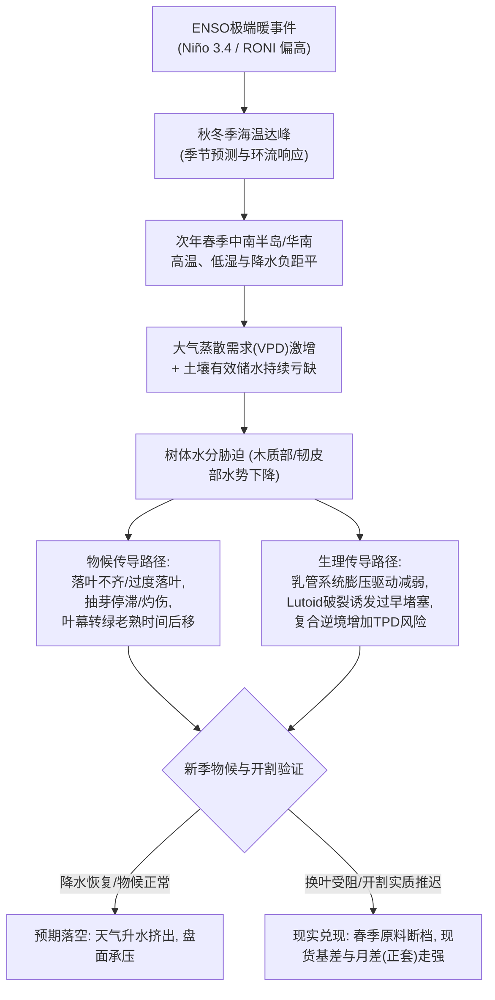

> **导语**：  
> 每逢强厄尔尼诺事件发酵，“停割期减产”与“天气升水”便频繁成为大宗商品盘面的交易题材。然而，熟悉热带物候的研究员往往会提出一个关键的审视视角：  
> **“中南半岛与中国热带产区，每年一季度本身就是季节性旱季与规律性停割期。既然本来就少雨，极端气候扰动的实质分水岭究竟在哪里？它又是如何从微观树体生理，一步步向现货原料与期货盘面传导的？”**  
>
> 气象冲击从来不是非黑即白的“减产定论”，而是一个充满变量与分支的因果链条。本文立足2026年秋冬全球极强ENSO事件的最新观测背景，摒弃“虚假精确”与主观臆断，深入橡胶树体水分生理学与热带水文机制，复盘真实的历史供需数据，为产业链与投资机构构建一套**可跟踪、可验证、可证伪的新季开割研判框架**。

---

## 核心速览（Executive Summary）

1. **现实背景与强度界定**：截至2026年9月，NOAA报告Niño 3.4区海温已升至+1.8℃，BOM相对Niño 3.4指数突破+2.5℃，秋冬极强事件概率高企。产业研究所称的“超强/极强厄尔尼诺”主要指海温距平（或RONI）达到约+2.0℃以上的极端事件（如历史上的1982/83、1997/98、2015/16），该称谓属于产业分析的强度界定，需结合区域季风与多气象模态综合研判。
2. **核心传导机制而非绝对定论**：常规干季与极端干季的关键区别不在于“降水是否归零”，而在于**“有效降水严重不足以补偿高温低湿带来的蒸散亏缺”**。高温与高饱和水汽压差（VPD）加速地表蒸散，使土壤储水持续透支，将外部水文干旱传导为树体内在的水分胁迫。
3. **微观生理逻辑**：割胶排胶依赖于韧皮部/乳管系统内的膨压差（文献测定约为0.69—1.4 MPa驱动压）。持续水分亏缺会削弱排胶的压力驱动，改变胶乳水分与流动特性；割胶时黄色体（Lutoid）破裂释放相关蛋白及凝固因子，加速塞栓形成并缩短排胶持续时间；严重干旱叠加过度割胶等管理逆境，会显著增加割面干涸症（TPD，死皮病）的发生风险。
4. **历史事实澄清**：
   * **1997/98年**：造成了东南亚严重干旱与林火，但FAO/IRSG数据显示当年全球天然橡胶产量并未出现年度负增长（1997年约6.44 Mt，1998年约6.47 Mt），其影响主要体现在局地产区阶段性原料供应与价格脉冲。
   * **2015/16年**：并非“全球供应断档真空”，2016年全球NR产量实际微增1.1%（至约12.40 Mt），但极端气候约束了主产区供给弹性，在全球消费增长至12.60 Mt的背景下形成了约199 kt的年度供需缺口，配合国内持续去库与宏观共振催化了后期的单边行情。
5. **从“必然推迟”到“验证链条”**：厄尔尼诺不等于“必然开割推迟或必然大涨”。科学的投研逻辑应是构建一条**“气象监测 $\rightarrow$ 物候观测 $\rightarrow$ 产业原料与库存 $\rightarrow$ 期货月差与基差”**的闭环验证网络，用动态数据代替主观预言。

---



---

## 一、 气象坐标：如何科学界定“极强厄尔尼诺”？

在大宗商品气象分析中，首要前提是厘清气象学监测指标与产业界通俗称谓的界限。

### 1. 概念与指标体系的演进
气候学界对厄尔尼诺事件的强度界定主要依据赤道中东太平洋海表温度距平（SSTA）：
* 国际上普遍以连续三个月滑动平均的 **Niño 3.4 区海温距平（ONI 指数）** 为基准：
  * 弱事件：$+0.5^\circ\text{C} \sim +0.9^\circ\text{C}$；
  * 中等事件：$+1.0^\circ\text{C} \sim +1.4^\circ\text{C}$；
  * 强事件：$+1.5^\circ\text{C} \sim +1.9^\circ\text{C}$；
  * 极强/超强事件（Very Strong / Extreme）：**$\ge +2.0^\circ\text{C}$**。
* **专业界定说明**：需要明确的是，“超强厄尔尼诺（Super El Niño）”主要是产业投研与媒体引申的通俗说法，国际气象学界通常使用“Strong / Very Strong / Extreme ENSO”。近年来，美国气候预测中心（NOAA CPC）亦逐步引入 **相对海洋厄尔尼诺指数（RONI, Relative Oceanic Niño Index）**，以剔除全球海温系统性变暖背景下的基准漂移。
* 在现代仪器观测历史上，真正达到极端强度的典型事件主要包括：**1982—1983年、1997—1998年、2015—2016年**。而2009—2010年（ONI峰值约+1.6℃）属于强事件，其特点在于叠加了极端副热带高压，引发了中国西南与湄公河流域百年一遇的局地春旱。

| 机构 | 核心监控模型 / 指标体系 | 研判侧重与区域视角 |
| :--- | :--- | :--- |
| **NOAA / CPC (美国)** | CFSv2动力模式、ONI / RONI 指数 | 侧重中东太平洋次表层热含量、沃克环流异常与季节性概率预报 |
| **ECMWF (欧洲)** | SEAS5 长期集合预报系统 | 擅长全球多模式集合分析，对东南亚季风环流与降水负距平敏感度高 |
| **BOM (澳大利亚)** | ACCESS-S 气候模型、SOI南方涛动指数 | 地处西南太平洋，紧密关注印度洋偶极子（IOD）与ENSO的共振特征 |
| **CMA (中国国家气候中心)** | BCC-CSM 数值预报模式 | 紧密跟踪低纬高原季风活动及其对云南西双版纳、华南热带产区的影响 |

### 2. 2026年现实背景：具备强事件的客观条件
截至2026年9月，NOAA最新诊断报告显示，赤道中东太平洋Niño 3.4区海温已升至 **+1.8℃**，东部赤道部分海域水温异常超过 **+3.0℃**，秋冬季维持非常强事件的概率显著偏高；澳大利亚气象局（BOM）监测到的相对Niño 3.4亦达到 **+2.51℃**。  
这表明，当前的宏观气象背景确已具备形成极强ENSO事件的观测基础，为探讨其对2026/27年度热带产区春季物候的潜在冲击提供了明确的现实切入点。

### 3. 季节性影响窗口而非简单“固定滞后”
很多分析常将气象滞后简化为“海温达峰后必然滞后1—2个季度爆发干旱”。这种表述并不准确。  
ENSO是一个复杂的海气耦合系统，大气对海洋异常的响应是动态且多变的。之所以天胶产业重点关注**次年2月—5月**，本质上是**气候响应敏感期与作物物候脆弱期的“时空相交”**：
* 中南半岛受热带季风气候控制，每年冬季至初春原本处于干季；
* 极端厄尔尼诺事件容易在春季抑制越赤道气流与对流活动，使副热带高压偏强、偏南控制产区；
* 这种环流异常恰好撞上了橡胶树**落叶、换叶、抽芽及新产季准备开割的敏感物候窗口**。

---

## 二、 破除认知盲区：干季本就少雨，极端天气的冲击机制何在？

“每年12月到次年3月本身就是常规旱季，橡胶树也处于越冬停割，多两个月少雨能有什么区别？”  
要回答这个疑问，必须从水分平衡的生态学本质切入：

### 1. 水分收支失衡：降水赤字与蒸散亏缺
热带季节性干旱森林并不会在普通干季枯死，其核心在于水文系统的动态平衡：
* **普通干季**：虽然月降水量处于年内低位，但土壤在前期雨季蓄积的深层水体、局地短时弱阵雨以及清晨空气湿度仍能维持地表至根系的最低耗水底线；
* **极端干季**：在极强厄尔尼诺诱发的高压下沉气流控制下，对流雨被完全阻断。根据泰国西部胶园及林区在2015/16年强厄尔尼诺期间的实测生态研究，干季降水量可显著下滑至常年同期的30%甚至更低，连续数月降水严重偏少。  
**核心矛盾不是“有没有雨”，而是降水输入完全无法补偿蒸散消耗，造成严重的“有效降水赤字”，迫使土壤与树体储水发生结构性透支。**

### 2. 高温与VPD（饱和水汽压差）抬升的大气蒸散需求
干旱与高温往往相伴相生。气温升高直接放大了空气的吸水能力：
$$\text{VPD} = e_s(T) - e_a$$
在高温低湿条件下，饱和水汽压差（VPD）显著增大，意味着**大气对地表与植物叶片的蒸散驱动力成倍增加**。即使橡胶树通过关闭气孔来减少蒸腾失水，持续高企的VPD与太阳辐射依然会加速土壤水分向上散失，使得根际有效含水量迅速向凋萎含水量（Wilting Point）逼近。

### 3. 土壤储水与根系吸水障碍
橡胶树具有庞大的水平扩展根系与深层吸收根网：
* 当表层土壤有效水分枯竭、发生板结龟裂时，分布在表层土中的大量吸收细根将面临严重的脱水胁迫；
* 树木被迫向深层土壤索取水分。然而，一旦极端少雨天气持续跨越整个冬春，深层土壤水分被持续耗竭且得不到补给，整株树体的木质部水势将大幅下跌，迫使树木进入自我保护性的代谢减缓或落叶停滞状态。

---

## 三、 微观生理机制：水分胁迫如何阻碍排胶与损伤树体？

割胶产胶并非被动的机械流淌，而是高度受制于树体内部水分代谢与细胞力学过程。

### 1. 韧皮部/乳管系统膨压驱动的减弱
胶乳流动是植物流体静力学驱动的过程。当割刀切断次生韧皮部中的乳管时，乳管内液体在压力差的作用下向割线切口喷涌排出：
* 植物生理学实验表明，割胶后乳管局部系统能够形成显著的压力驱动差（文献测定驱动压约为 **0.69—1.4 MPa**，且具有明显的昼夜与水分波动）；
* 当胶树处于严重水分亏缺状态时，全树水势与组织膨压大幅降低，**流体动力学驱动压显著削弱**，导致排胶初速度变缓；
* 排胶并不能在切开后无限制持续。在常规条件下，随着割口堵塞，排胶速度通常在数十分钟内呈现显著衰减；而在干旱胁迫下，微弱的膨压驱动使得出胶历时更加短暂，甚至割口仅见微量胶乳渗出即告停止。

### 2. 黄色体（Lutoid）破裂与乳管塞栓堵塞机制
胶乳流动的停止取决于乳管切口处塞栓（Plugs）的形成速度：
* 割胶引起乳管内压力骤降，胶乳中被称为**黄色体（Lutoids）**的微型细胞器因压力震荡和渗透压改变而发生破裂；
* 现代蛋白质组学与生物化学研究表明，黄色体破裂释放出的带正电荷蛋白质（如Hevein及酸性凝固相关酶类）与带负电荷的橡胶烃粒子相互作用，促使橡胶粒子聚集凝固；
* 在干旱和高温胁迫下，树体抗氧化系统负荷过重，胶乳生化环境改变，割口处凝结塞栓的形成往往更加迅速，排胶通道过早闭合，有效产胶量因而大幅受抑。

### 3. 水分亏缺对胶乳理化性质与产量的多重影响
* 过去部分市场观点认为“干旱一定会导致干胶含量（DRC）虚高”，这并不全面。国内外多项农艺与逆境生理研究表明：**严重干旱不仅阻碍光合碳同化物的合成与转运，减少产胶前体物质供给，还会导致胶乳产出率与有效干胶产出（Dry Latex Yield）同步下滑**；充足而合理的水分补给反而是保障胶乳产量与橡胶烃生物合成的基础。
* **割面干涸症（TPD，死皮病）风险**：TPD是天然橡胶树乳管系统功能紊乱乃至局部坏死的复杂生理病害。如果胶农在干旱缺水、树体水分亏缺的背景下，为了维持收入而盲目增加割胶刀次、加深割皮或滥用乙烯利刺激剂，强烈的氧化应激与机械损伤将显著提升割面干涸的发病几率，严重削弱胶树中长期的生产潜力。

---

## 四、 历史事实厘清：极端厄尔尼诺下的全球产量与价格真相

对历史事件的复盘必须建立在严肃统计数据的基础之上。盲目夸大历史冲击，往往会导致研究结论偏离客观事实。

| 历史事件 | 气候特征与海温峰值 | 局地产区实际物候与微观影响 | 全球天胶供需真实数据 | 盘面与现货资产表现 |
| :--- | :--- | :--- | :--- | :--- |
| **1997—1998年<br/>极强事件** | **Niño 3.4 SSTA 达 +2.4℃**<br/>世纪典型极端暖事件 | 印度尼西亚苏门答腊、加里曼丹林火肆虐；中南半岛干季延长，局部开割出现延期。 | **打破“大幅减产”假说**：FAO/IRSG数据显示，1997年全球NR产量约**6.44 Mt**，1998年约**6.47 Mt**，**全球年产量微增而非负增长**。干旱主要引发了局部原料断档，而非全球供给塌陷。 | 受亚洲金融危机全面爆发冲击，宏观系统性通缩压制了大宗资产，天胶价格低位震荡，但产区断胶使局部原料收购价具备韧性。 |
| **2009—2010年<br/>强事件** | **Niño 3.4 SSTA 达 +1.6℃**<br/>强ENSO叠加极端大气高压 | 中国西南（云南、广西）与中南半岛遭遇历史罕见的春旱；云南胶园抽叶滞后，开割大面积推迟至5月中下旬。 | **局地弹性受阻 + 宏观四万亿刺激**：云南主产区有效割胶窗口被压缩近两个月，局部原料供给极度偏紧，与四万亿投资带动的国内重卡、汽车消费爆发形成共振。 | 供求极度失衡催化了史诗级商品牛市，沪胶主力合约自2009年初低位持续拉升，至2011年2月创下**42,000—43,000元/吨上方**的历史极值。 |
| **2015—2016年<br/>极强事件** | **Niño 3.4 SSTA 达 +2.6℃**<br/>观测史上最高海温极值之一 | 泰国遭遇多十年罕见旱灾，水库蓄水偏低，胶树黄叶与落叶期延长，抽新叶缓慢，主产国春季开割普遍推迟数周。 | **打破“供应真空”假说**：IRSG与橡委会数据显示，2016年全球产量约**12.40 Mt**（2015年约12.27 Mt），**仍实现约1.1%的微幅增长**；但由于全球消费达**12.60 Mt**，年度供需缺口约**199 kt**，国内保税区去库加速。 | 上半年现货原料受抑，下半年在供给弹性不足、去库彻底以及国内黑色/能化去产能宏观反弹的带动下，沪胶自9500元附近强劲反弹突破20000元。 |
| **2023—2024年<br/>强事件** | **Niño 3.4 SSTA 约 +2.0℃**<br/>WMO确认峰值约2.0℃后回落 | 泰国北部、东北部2024年一季度遭遇严重高温干旱，同时泰南受落叶病与局部天气反复扰动，新胶开割上量艰难。 | **多因素复合支撑**：泰国生胶与胶水供给收缩，叠加EUDR合规原料备货诉求、下游轮胎出口坚韧，供需阶段性转紧。 | 2024年二季度泰国田间胶水收购价格一度突破**85—90泰铢/公斤**，高原料成本为盘面奠定了强劲的估值支撑。 |

### 历史数据的关键启示：
1. **不能简单推导“极强厄尔尼诺 = 全球年度总减产”**：全球天然橡胶生产具有广阔的地理分布与林龄调整空间，1998年与2016年的年产量均未出现塌陷。极端气候的核心杀伤力在于**“阶段性节奏扰动”与“弹性受限”**——它通过挤压春季有效供给，削弱增产潜力，一旦遇上需求回暖，便极易形成供需错配。
2. **多因子共振才是大行情的驱动源**：2010年的超级牛市与2016年的大反弹，无一例外是**“气候致开割推迟/原料趋紧”与“宏观刺激/强需求周期”**双轮驱动的结果。脱离需求端去单纯炒作干旱，往往面临证伪风险。

---

## 五、 新产季开割推演：是“必然推迟”还是“情景假设”？

在专业投研中，不应轻言“必然开割推迟”，而应深入分析开割决策背后的**物候生理硬约束与区域异质性**。

### 1. 换叶物候：开割时间的核心生物学硬约束
橡胶树是多年生落叶阔叶树种，其年周期遵循明确的物候律动：

$$\text{落叶期（越冬停割）} \longrightarrow \text{抽芽萌动期} \longrightarrow \text{伸展淡红嫩叶} \longrightarrow \text{叶色完全转绿老熟} \longrightarrow \text{恢复割胶生产}$$

* **抽叶需水高峰**：新叶生长发育需要消耗树体大量非结构性碳水化合物（NSC）与水分。缺水会导致顶芽萌发受阻、抽芽推迟；强烈的干热风极易灼伤初生嫩芽，导致新叶畸形脱落；
* **开割标准**：树体未完全展叶转绿之前，体内以消耗养分建构叶冠为主，光合作用净产物极低。若在此时贸然开割，将造成树势严重衰退。**叶幕转绿老熟的迟早，在农艺上客观决定了开割的启动窗口。**

### 2. 主要产区的分化情景分析

```
【高脆弱区：中国云南西双版纳】
- 气候特征：干湿季极分明，北缘次适宜种植区，对水热条件极其敏感。
- 关键风险：若冬春旱情发展，抽叶进程极易延缓，开割时间对春雨有强依赖。

【高脆弱区：泰国北部与东北部】
- 气候特征：沙质土壤保水力差，胶园树龄偏小，抗逆能力较弱。
- 关键风险：易受高温热浪直击，是近年来气候异常推迟开割与单产受损的重灾区。

【中脆弱区：泰国南部主产区（宋卡/合艾等）】
- 气候特征：受双季风影响，年降水量充沛，天然停割期较短。
- 关键风险：厄尔尼诺期间若雨季推迟，干旱主要表现为初割期胶水偏稀、干含偏低、产胶量上量迟滞。

【独立生态区：印度尼西亚（苏门答腊/加里曼丹）】
- 气候特征：赤道雨林气候，四季割胶。
- 关键风险：极强厄尔尼诺带来的风险主要不是低温落叶，而是泥炭地火灾烟霾削弱光合辐射，以及持续干热拖累单产。
```

---

## 六、 投资与产业链：从“主观押注”转向“交易验证框架”

在实盘中，直接基于天气预报进行单边交易风险极高。更为专业的方式是将极端气候作为**变量情景**，构建可动态证伪的交易策略与风控体系。

### 1. 交易逻辑验证与证伪机制

```markdown
┌───────────────────┬────────────────────────────────────────────────────────────────┐
│ 阶段              │ 核心检验条件与盘面表现                                         │
├───────────────────┼────────────────────────────────────────────────────────────────┤
│ 阶段一：          │ 【验证条件】：气象机构上调厄尔尼诺强度，产区高温负降水距平持续。│
│ 预期发酵期        │ 【盘面逻辑】：远月合约计入风险升水，资金买盘推升波动率。       │
│ (12月 - 次年2月)  │ 【证伪警报】：冬春季中南半岛出现充沛非季节性降水，预期提前退潮。│
├───────────────────┼────────────────────────────────────────────────────────────────┤
│ 阶段二：          │ 【验证条件】：抽叶明显推迟，泰国胶水/杯胶收购价逆势大涨，基差坚挺。│
│ 物候与现实检验期  │ 【盘面逻辑】：正套驱动（近月表现强于远月，如RU05-09走扩），去库顺畅。│
│ (3月 - 5月)       │ 【证伪警报】：开割如期进行，产区原料收购价平稳，青岛库存累库超预期。│
├───────────────────┼────────────────────────────────────────────────────────────────┤
│ 阶段三：          │ 【验证条件】：雨水恢复后胶树产胶恢复速度，是否转入拉尼娜洪涝。 │
│ 产能释放与再平衡  │ 【盘面逻辑】：关注下游轮胎开工承接能力；若旱转涝，易引发二次题材。│
│ (6月及以后)       │ 【证伪警报】：海外与国内割胶全线放量，下游需求不及预期，基差崩塌。│
└───────────────────┴────────────────────────────────────────────────────────────────┘
```

### 2. 投资策略的情景化构建
* **月差正套（Bull Spread）的前提条件**：
  * **成立条件**：春季物候切实受阻，国内港口与厂内原料去库加速，泰国原料收购价持续高企 $\rightarrow$ 驱动近月合约相对坚挺，支持“买近抛远（如RU05-09、NR近远月）”；
  * **风险边际**：密切跟踪交割品老胶仓单的注销节奏与现货贴水幅度，谨防虚高的近月升水引发仓单集中压制。
* **品种间相对价值（RU vs NR / RU vs BR）**：
  * **RU 与 NR**：重点观测云南全乳胶减产与浓乳分流原料的强度。若国内开割延期导致全乳原料极度紧缺，RU交割品溢价走扩；
  * **RU 与 BR**：天胶强于合成胶的逻辑必须受丁二烯成本与下游全钢/半钢胎配方替代边界的约束，需将原料价差控制在合理经济区间内评估。

### 3. 产业链实体的实操建议
* **轮胎与橡胶制品企业**：
  * 摒弃“赌新胶必然大跌”或“赌减产盲目追高”的双向极端心态；
  * 重点把握每年一季度至二季度的虚拟库存构建，利用期权（如累积看涨期权或买入看涨领口策略）在停割期锁定采购成本上限。
* **进出口与现货贸易商**：
  * 在新季开割推迟预警期，严禁盲目裸卖空近月未到港纸货；
  * 密切防范东南亚产区船期延宕与非标套利违约风险。

---

## 七、 产业实战：天胶“气候—物候—产业”动态监测雷达

摆脱定性猜想，回归客观高频跟踪。建议投研团队建立以下四级量化雷达体系，动态追踪冲击传导：

```markdown
┌────────────────────────────────────────────────────────────────────────┐
│             天然橡胶「气候—物候—产业」全链条动态监测雷达                │
├──────────────────┬──────────────────────┬──────────────────────────────┤
│ 跟踪层级         │ 核心监测指标         │ 重点关注方向与数据源         │
├──────────────────┼──────────────────────┼──────────────────────────────┤
│ 一级：宏观气象   │ Niño 3.4 / RONI 指数 │ NOAA/BOM：海温异常持续性与达峰时点│
│                  │ SOI 南方涛动指数     │ 持续负值状态下的越赤道气流响应 │
│                  │ 产区降水距平与VPD    │ 泰国气象局(TMD)/ECMWF：产区旱热程度│
├──────────────────┼──────────────────────┼──────────────────────────────┤
│ 二级：物候生理   │ 产区落叶与换叶进度   │ 西双版纳/泰北：落叶整齐度、抽芽延迟日│
│                  │ 叶冠老熟转绿比例     │ 3-4月胶树展叶情况、白粉病受灾程度 │
│                  │ 产区首割试割动向     │ 当地农垦、胶协通告的初次开割日期 │
├──────────────────┼──────────────────────┼──────────────────────────────┤
│ 三级：现货原料   │ 泰国宋卡生胶/白胶水  │ 田间胶水价格、胶水与杯胶溢价幅度 │
│                  │ 国内产区胶水开秤价   │ 云南版纳、海南原料收购站初春挂牌价 │
│                  │ 显性库存去化节奏     │ 青岛保税区/一般贸易库存周度出库速度│
├──────────────────┼──────────────────────┼──────────────────────────────┤
│ 四级：期货衍生品 │ 月差期限结构         │ RU / NR 主力与次主力合约价差变动 │
│                  │ 基差与非标价差       │ 泰标、混合胶对盘面基差变动趋势   │
│                  │ 上期所天胶仓单注销   │ 老胶仓单注销与新仓单注册进展     │
└──────────────────┴──────────────────────┴──────────────────────────────┘
```

---

## 结语

在天然橡胶的投研体系中，气象研究的魅力不在于制造耸人听闻的减产预言，而在于它揭示了**自然界的物理水文法则如何与树木生命节律紧密咬合**。

干季本就少雨，但并不意味着它能承受降水亏缺与高温蒸散的持续透支。当海温扰动在大气中逐步具象为中南半岛的干热风、当抽芽的枝头等待雨水滋润、当乳管内的流体动力学悄然改变，供应的弹性正在经受无声的检验。

**不将故事当真理，不将可能当必然。** 唯有建立扎实的微观植物生理认知，尊重严肃的历史统计事实，以严密的数据雷达步步求证，方能在充满不确定性的商品交易中把握真正的确定性。