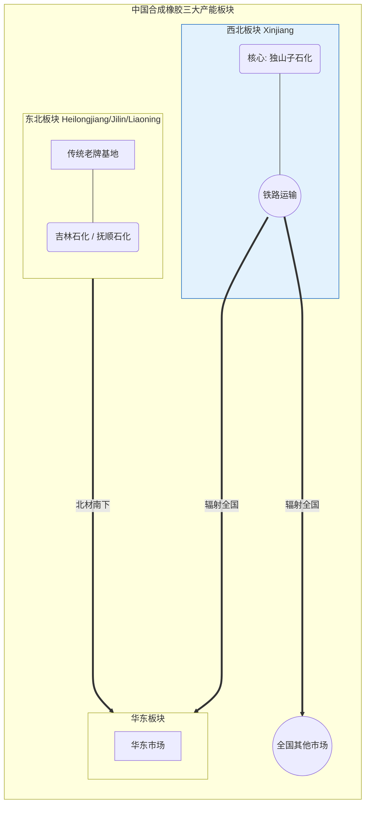

## **第一章 绪论：合成橡胶的商品属性与研究框架构建**

### **1.1 研究背景与战略意义**

在2026年的全球工业版图中，合成橡胶（Synthetic Rubber, SR）作为三大合成材料之一，其战略地位正经历着前所未有的重估。作为一种典型的高分子弹性体，合成橡胶不仅是现代交通运输业的基石——承载着全球数以十亿计的轮胎与汽车零部件制造，更是国防工业、医疗卫生、建筑工程及日用消费品领域不可或缺的关键原材料。与源自农业种植的天然橡胶（Natural Rubber, NR）不同，合成橡胶是石油化学工业的高度加工产物，其产业链条长、技术壁垒高、金融属性强，且受原油价格波动及宏观经济周期的双重钳制。  
当前，全球合成橡胶产业正处于供需格局深刻重塑的周期节点。从供给端看，以中国为代表的亚洲新兴经济体产能持续扩张，推动了全球供应重心的东移，并逐步改变了传统的贸易流向；从需求端看，汽车产业的电动化（EV）浪潮对轮胎性能提出了低滚阻、高耐磨、低噪音的严苛要求，倒逼上游合成橡胶产品结构向溶聚丁苯橡胶（SSBR）、稀土顺丁橡胶（Nd-BR）等高端化方向迭代。此外，随着上海期货交易所（SHFE）丁二烯橡胶（BR）期货的上市运行及其衍生品市场的日益成熟，合成橡胶的定价体系正从传统的成本加成模式向期现结合的金融化定价模式演变。  
本报告旨在构建一个逻辑严密、数据详实、多维度的合成橡胶商品研究框架。该框架将打破单一的市场供需分析范式，向上追溯至原油裂解与单体供应的成本传导机制，向下延伸至终端汽车与非轮胎领域的消费弹性分析，横向覆盖天然橡胶的替代博弈与全球贸易流向，纵向深入宏观政策（如“双碳”目标、反倾销政策）对产业周期的长远影响。通过对2024-2026年市场数据的深度复盘与前瞻预测，本报告致力于为产业投资者、生产商及贸易商提供决策支持。

### **1.2 合成橡胶的分类体系与物理特性**

合成橡胶并非单一商品，而是一个庞大的高分子材料家族。在商品研究框架中，我们依据市场容量与通用性，将其划分为通用合成橡胶与特种合成橡胶两大类。本报告的研究核心聚焦于期货交割品种及市场流通量最大的通用胶种。

#### **1.2.1 通用合成橡胶的核心品种**

丁苯橡胶（Styrene-Butadiene Rubber, SBR）  
SBR是全球产量最大、消费最广的通用合成橡胶，占据了全球合成橡胶总消费量的约40% 1。其由丁二烯（Butadiene）与苯乙烯（Styrene）共聚而成，根据聚合工艺的不同，进一步细分为乳聚丁苯橡胶（ESBR）和溶聚丁苯橡胶（SSBR）。

* **ESBR**：技术成熟，加工性能优异，耐磨损、耐老化，但在耐热性和生热性方面略逊一筹，广泛应用于乘用车轮胎胎面、胶管、胶带及鞋材。  
* **SSBR**：具有更低的滚动阻力和更优的抗湿滑性能，是制造高性能绿色轮胎（Green Tires）及电动汽车轮胎的首选材料。随着EV渗透率的提升，SSBR在SBR消费结构中的占比逐年攀升 2。

顺丁橡胶（Polybutadiene Rubber, BR）  
BR是仅次于SBR的第二大合成橡胶品种，主要由丁二烯聚合而成。其分子结构赋予了其极高的弹性（在所有橡胶中弹性最好）、优异的耐磨性及耐寒性 4。在轮胎制造中，BR常与天然橡胶并用，用于轮胎侧壁和胎面以提高耐磨寿命和抗屈挠性能。由于其单体来源单一（仅依赖丁二烯），BR的价格波动与丁二烯成本的相关性极高，且作为SHFE期货标的，其金融属性最强 5。  
乙丙橡胶（Ethylene-Propylene Rubber, EPDM）  
EPDM由乙烯、丙烯及少量非共轭二烯烃共聚而成。由于主链饱和，其具备卓越的耐臭氧、耐候、耐热及耐化学腐蚀性能，主要应用于汽车密封条、建筑防水卷材及电线电缆护套 2。  
丁基橡胶（Butyl Rubber, IIR）  
由异丁烯与少量异戊二烯共聚制得。其最大的特性是气密性极佳，透气率仅为天然橡胶的1/8，因此是轮胎内胎、硫化胶囊及医用瓶塞的绝对主导材料 4。  
丁腈橡胶（Nitrile Rubber, NBR）  
由丁二烯与丙烯腈乳液聚合而成，以优异的耐油性著称，广泛用于耐油胶管、密封件及油田工业。2025年中国NBR产能已达29.5万吨，供需处于紧平衡向宽松过渡的阶段 6。

### **1.3 商品研究的基本方法论**

构建合成橡胶的投研框架，需遵循“宏观定方向、产业定策略、基差定节奏”的逻辑范式。

1. **宏观维度**：关注全球经济周期、货币政策（如美联储降息预期）、地缘政治（原油价格波动）及产业政策（中国“双碳”政策、欧盟EUDR法案）。宏观因子决定了商品价格的长期重心与波动区间。  
2. **基本面维度**：  
   * **成本支撑**：原油-石脑油-单体（丁二烯/苯乙烯）的裂解价差与利润分配。  
   * **供需平衡**：产能投放周期、装置检修率（开工率）、下游轮胎配套与替换需求、进出口贸易流向。  
   * **替代效应**：天然橡胶与合成橡胶的价差及其引致的配方调整。  
3. **微观与资金维度**：社会库存与保税区库存的变动趋势、期货仓单数量、月间价差结构（Contango/Backwardation）、虚实盘比与持仓结构分析。

## **第二章 成本传导机制：从原油到单体的价值链**

合成橡胶作为石油化工产业链的末端产品，其价格形成机制首先受制于上游原料的成本推升或塌陷。深入理解成本传导的滞后性与非线性关系，是预判价格走势的前提。

### **2.1 产业链溯源：原油与石脑油的基石作用**

合成橡胶的碳链骨架源于原油。原油经炼厂常减压蒸馏产出石脑油（Naphtha），石脑油再经蒸汽裂解装置（Steam Cracker）生产乙烯、丙烯及C4馏分。C4馏分经过抽提工艺，分离出丁二烯（Butadiene），这是合成橡胶（尤其是BR和SBR）最核心的单体 7。  
虽然从长期看，合成橡胶价格与布伦特（Brent）或WTI原油价格保持正相关，但在中短期内，二者的相关性往往发生背离。这种背离源于产业链中间环节——裂解装置的复杂经济性。石脑油不仅是生产丁二烯的原料，更是乙烯的主原料。因此，原油价格波动传导至橡胶端，存在1-3个月的滞后期，且幅度会受到裂解利润（Cracker Margin）的缓冲或放大 7。

### **2.2 丁二烯：定价机制与“价格接受者”困境**

在合成橡胶的成本构成中，丁二烯占据了绝对主导地位。对于顺丁橡胶（BR），丁二烯成本占比接近100%；对于丁苯橡胶（SBR），丁二烯与苯乙烯的消耗比约为72:28，丁二烯依然是决定成本波动的核心变量 8。  
**特殊的供应逻辑**：丁二烯的一个显著特征是其作为乙烯裂解副产品的属性。在典型的石脑油裂解装置中，乙烯是主产品，丁二烯仅占产出的4-5%。这意味着，裂解装置的开工率几乎完全取决于乙烯的盈利情况，而非丁二烯的需求。即便丁二烯价格暴跌，只要乙烯利润丰厚，裂解装置仍会满负荷运转，导致丁二烯被动产出，加剧供应过剩。反之，若乙烯亏损导致装置降负，丁二烯供应将瞬间收紧，价格可能暴涨。这种“副产品”属性使得丁二烯供应缺乏弹性，价格波动极为剧烈 9。  
**2025年的成本塌陷案例**：2025年，中国丁二烯市场经历了从年初10,800元/吨的高位向年末7,733元/吨的剧烈下行，跌幅达28.4%。这一暴跌并非源于原油崩盘，而是因为国内乙烯产能集中释放带来的丁二烯副产增量（新增产能约98万吨）远超下游橡胶需求增量。这种原料端的成本塌陷，直接拖累了BR和SBR价格在2025年呈现“前高后低”的走势，使得合成橡胶失去了成本支撑 8。

### **2.3 苯乙烯：SBR的第二成本极**

苯乙烯（Styrene）作为SBR的另一重要单体，其价格受纯苯（Benzene）和乙烯的双重影响。纯苯直接挂钩原油和重整装置利润，而乙烯则受裂解供需影响。在2025年，尽管丁二烯价格大幅下挫，但苯乙烯价格的相对坚挺在一定程度上缓解了SBR成本的跌幅。然而，由于苯乙烯在SBR成本中权重较小（约25-30%），其对最终胶价的影响力弱于丁二烯。研究员在构建SBR成本模型时，通常采用如下公式进行估算：

$$\text{SBR成本} = 0.72 \times P\_{\text{丁二烯}} + 0.28 \times P\_{\text{苯乙烯}} + \text{加工费}$$

其中加工费视工艺路线（乳聚或溶聚）不同，一般在1500-2500元/吨之间波动 11。

### **2.4 辅助原料与能源成本**

除单体外，合成橡胶生产还涉及催化剂（如镍系、钴系、稀土钕系）、溶剂油、防老剂及大量的能源消耗（蒸汽、电力）。

* **能耗**：据测算，每吨SBR生产约需消耗5000 Btu的蒸汽热量。在能源价格高企的年份（如2022年），公用工程成本在总成本中的占比显著提升，成为挤压利润的重要因素 13。  
* **橡胶填充油**：对于充油丁苯橡胶（如SBR 1712），填充油（高芳烃油或环保型TDAE油）也是成本的一部分。随着欧盟REACH法规对多环芳烃（PAHs）含量的限制，Sinopec等企业开发了ARE工艺生产环保填充油，虽然增加了技术成本，但也提升了产品的溢价能力 14。

## **第三章 供给侧格局：全球产能转移与中国崛起**

供给侧的产能周期、区域分布及企业竞争格局，是决定市场供需平衡的基石。过去十年，全球合成橡胶产业经历了深刻的地理大迁徙，中国已无可争议地成为全球最大的生产基地。

### **3.1 全球产能分布与主要玩家**

根据国际合成橡胶生产者协会（IISRP）2025年的最新数据，全球合成橡胶产能继续向亚洲集中，中国企业的市场份额进一步扩大。  
**表 3-1：2025年全球五大合成橡胶生产商产能排名**

| 排名 | 生产商 | 总部 | 产能（千吨/年） | 动态变化与战略 |
| :---- | :---- | :---- | :---- | :---- |
| 1 | **中国石化 (Sinopec)** | 中国 | 1,920 | 产能微增，稳居全球榜首，重点布局高端SSBR与稀土BR 15 |
| 2 | **阿朗新科 (Arlanxeo)** | 荷兰 | 1,894 | 前沙特阿美全资子公司，产能略有收缩，聚焦特种胶种 |
| 3 | **中国石油 (PetroChina)** | 中国 | 1,660 | 同比大增20%，扩张迅猛，依托上游炼化一体化优势 15 |
| 4 | **西布尔 (Sibur/NKNH)** | 俄罗斯 | 1,297 | 受地缘政治制裁影响，出口重心转向中国及亚洲市场 |
| 5 | **锦湖石化 (Kumho)** | 韩国 | 1,207 | 亚洲重要供应商，在华设有合资工厂 |

数据来源：基于 15 整理  
这一排名揭示了两个关键趋势：

1. **中国双巨头的统治力**：中石化与中石油（“两桶油”）合计产能占全球前五名总产能的44%以上，掌握了全球合成橡胶供应的话语权。  
2. **欧洲产能的停滞与收缩**：受制于高昂的能源成本和环保法规，欧洲生产商（如Synthos、Versalis）产能增长乏力，部分装置面临关停或转型 16。

### **3.2 中国供给侧深度解析：国企主导与民企突围**

中国合成橡胶产业呈现出“央企领航、民企追赶、结构分化”的鲜明特征。

#### **3.2.1 产能扩张周期（2024-2026）**

2024至2026年是中国合成橡胶产能投放的密集期。2025年，中国顺丁橡胶（BR）总产能达到199.2万吨，同比增长11.16%。新增产能主要来自裕龙石化（15万吨）和吉林石化（5万吨）的装置投产 8。  
展望2026年，国内BR产能预计将进一步增加40万吨，达到239.2万吨。主要规划项目包括：

* **中哲集团（宁波）**：20万吨/年低顺丁橡胶装置。  
* **独山子石化**：10万吨/年稀土/镍系切换装置。  
* **燕山石化**：10万吨/年BR装置 8。

这种高强度的产能投放，直接导致了常规胶种（如BR9000、SBR1502）的供应过剩，行业开工率长期维持在60%-70%的偏低水平，迫使企业寻求出口或转产。

#### **3.2.2 区域分布特征**

中国合成橡胶产能高度集中于**华东**（山东、江苏、浙江）、**东北**（黑龙江、吉林、辽宁）和**西北**（新疆）三大板块。

* **华东地区**：依托江苏扬子石化、齐鲁石化、镇海炼化及新兴的民营大炼化（如浙江石化），是最大的生产与消费基地。山东省作为轮胎制造大省，对合成橡胶的就地消化能力极强。  
* **东北地区**：吉林石化、抚顺石化等老牌基地，是传统的合成橡胶供应源，产品常年“北材南下”流向华东与华南市场。  
* **西北地区**：以**独山子石化**为核心。独山子石化不仅规模巨大，更在技术上处于领先地位，其自主研发的官能化SSBR填补了国内空白，成为环保轮胎原料的标杆企业。其地理位置虽偏，但通过铁路运输辐射全国 18。

#### **3.2.3 技术结构升级**

虽然总量过剩，但结构性短缺依然存在。2025年，中国稀土顺丁橡胶（Nd-BR）产能占比约为28%，预计2026年将提升至35%以上。稀土BR因其分子链规整度高、催化剂活性好，在高性能轮胎中的应用无可替代，是产业升级的主要方向。相比之下，传统的镍系BR产能严重过剩，面临淘汰或技术改造的压力 8。

### **3.3 检修周期与供应弹性**

合成橡胶装置的检修是影响短期供应的关键变量。通常，装置每1-2年进行一次大修，多安排在春季（3-5月）或秋季（9-10月）。

* **季节性规律**：二、三季度往往是检修高峰期，供应收缩可能引发价格阶段性反弹。例如，2025年5月，受部分装置（如兰州石化）停车检修影响，BR价格曾短暂反弹至12,866元/吨 10。  
* **利润导向**：当丁二烯价格过高导致橡胶生产亏损时，工厂会安排“经济性检修”或降负荷运行；反之，若利润修复，闲置产能会迅速复产。这种供应弹性限制了橡胶价格的上涨空间。

## **第四章 需求端分析：轮胎驱动与消费结构演变**

需求端是决定价格弹性的另一只手。在合成橡胶的下游消费结构中，轮胎行业占据了约70%的绝对份额，因此行业内有“得轮胎者得天下”的说法。此外，鞋材、胶管胶带及改性塑料等非轮胎领域也提供了重要的需求支撑。

### **4.1 轮胎行业：基本盘的稳健与分化**

2024-2025年，中国轮胎行业展现出强大的韧性。2025年1-11月，中国轮胎累计产量达11.03亿条，同比增长0.6%。全钢胎（商用车用）平均开工率约为62%，半钢胎（乘用车用）开工率维持在70%以上的高位 8。

1. **配套市场（OE）**：受宏观经济复苏缓慢及房地产开工不足影响，商用车（重卡）产销增速放缓，导致全钢胎配套需求疲软。然而，乘用车产量，特别是新能源汽车产量的爆发式增长，为半钢胎需求提供了强劲动力。  
2. **替换市场（RT）**：作为存量市场，替换需求与汽车保有量正相关。随着中国汽车保有量突破3亿辆，替换市场的刚性需求成为合成橡胶消费的“压舱石”。  
3. **出口市场**：中国轮胎具有极高的性价比，出口量约占总产量的一半。尽管面临欧美“双反”调查（如2025年欧盟对华轮胎发起的反补贴调查），中国企业通过在东南亚（泰国、越南、柬埔寨）建厂，成功规避了部分贸易壁垒，维持了全球市场份额 6。

### **4.2 电动汽车（EV）浪潮：重塑合成橡胶需求逻辑**

电动汽车的普及是合成橡胶产业面临的最大变量，也是最大机遇。EV对轮胎性能提出了三大新要求：更强的承载能力（电池导致车重增加20-30%）、瞬间大扭矩的耐磨性、以及为了延长续航里程的极致低滚阻 2。

* **天然橡胶的局限**：天然橡胶虽然弹性好，但在耐磨性和抗湿滑性上难以同时满足EV的苛刻要求。  
* **合成橡胶的机遇（SSBR与BR）**：溶聚丁苯橡胶（SSBR）结合白炭黑（Silica）配方，能够显著降低轮胎滚动阻力并提升抓地力，被称为“绿色轮胎”的黄金搭档。顺丁橡胶（BR）则因其优异的耐磨性，被大量用于提升轮胎的使用寿命。  
* **配方革命**：有研究指出，EV轮胎中合成橡胶的添加比例可能比传统燃油车轮胎高出25-50%。预计到2026年，随着EV渗透率突破50%，高端SSBR和稀土BR的需求增速将显著跑赢传统胶种 10。

### **4.3 非轮胎领域：多元化的增长极**

除去轮胎，约30%的合成橡胶流向了非轮胎领域，这一领域的特点是细分众多、技术要求各异。

* **制鞋业**：作为全球最大的鞋类生产国，中国制鞋业对高发泡倍率的BR和SBR需求巨大。2025年，尽管内需平淡，但运动鞋出口回暖带动了相关胶种的消费 21。  
* **工业橡胶制品**：包括输送带、胶管、密封件等。2025年，随着基建投资的边际改善，重卡销量同比增长13%，间接拉动了工业橡胶制品的需求 8。  
* **改性塑料（HIPS/ABS）**：聚苯乙烯（HIPS）和ABS树脂的生产需要使用BR或SBR作为增韧剂。家电和消费电子市场的复苏对这一板块构成利好。

### **4.4 进出口格局的逆转：从净进口到净出口**

中国合成橡胶产业正经历历史性的贸易逆转。长期以来，中国是合成橡胶的净进口国，尤其是高端牌号依赖进口。但随着国内产能的爆发式增长，2025年中国BR出口量呈现井喷态势。

* **数据实证**：2025年1-11月，中国BR出口量达28.72万吨，同比激增22.21%；而进口量为25.4万吨，仅微增3.25%。这标志着中国在常规合成橡胶领域已实现自给有余，并开始向全球输出产能 8。  
* **贸易流向**：主要的出口目的地包括越南、泰国、印度及马来西亚。这与中国轮胎企业产业链外迁至东南亚的路径高度重合，形成了“原料-半成品-成品”的跨境产业链闭环 23。

## **第五章 替代博弈：天然橡胶与合成橡胶的联动机制**

在商品研究框架中，天然橡胶（NR）与合成橡胶（SR）的关系并非简单的替代，而是包含“技术互补”与“价格博弈”的双重逻辑。

### **5.1 技术互补与替代边界**

1. **技术刚性（不可替代区）**：  
   * **载重胎**：天然橡胶具有独特的应变诱导结晶特性，赋予其极高的抗撕裂强度和低生热性。因此，在全钢载重子午胎（TBR）和工程机械轮胎中，NR的使用比例高达60-70%，合成橡胶难以大规模替代，否则会导致轮胎爆裂或寿命骤降 25。  
   * **乘用胎**：在半钢乘用子午胎（PCR）中，为了追求高速性能、耐磨和抓地力，合成橡胶（SBR/BR）是主力，占比可达50%以上，NR仅作为辅助。  
2. **经济弹性（可替代区）**：  
   * 在胶管、胶带、胶鞋及部分低速农用轮胎中，NR与SR（主要是SBR和再生胶）存在较大的替代空间。当二者价差超过一定阈值（如NR比SR贵2000元/吨以上）时，下游工厂会调整配方，增加廉价胶种的用量。

### **5.2 价差逻辑与2025年异象**

历史上，NR与SR的价格通常保持高度相关（相关系数\>0.8），且NR价格通常高于SR。价差是驱动替代行为的核心指标。

* **2025年价差扩大**：2025年末，市场出现了一个显著的异象——NR与SR的价差扩大至十年高位。原因在于：供应端，NR受东南亚天气（台风、洪水）及收储传闻影响，价格坚挺；而SR受上游丁二烯成本塌陷及产能过剩拖累，价格一路下行。  
* **替代效应触发**：据SunSirs监测，BR价格一度比NR低4000元/吨以上。这种极端的负价差极大地刺激了轮胎企业在非关键部位增加合成胶用量的意愿，提供了显著的替代需求增量，这也成为了支撑2025年底SR价格企稳的重要因素 8。

## **第六章 库存周期、物流与贸易流向**

库存是供需错配的蓄水池，也是价格拐点的先行指标。合成橡胶的库存分析需区分社会库存与保税区库存。

### **6.1 库存的双重结构分析**

1. **社会库存（隐性库存）**：指存在于国内贸易商仓库、工厂原料仓及在途货物的总量。2025年四季度，由于下游需求进入淡季，且买涨不买跌情绪浓厚，社会库存呈现累积趋势。这种累库压制了现货价格的反弹高度 28。  
2. **保税区库存（显性库存）**：主要集中在青岛、上海等港口，以美元计价的进口胶为主。2025年初数据显示，青岛保税区库存约为50.4万吨，处于历史中高位 29。高企的保税库存意味着进口货源充裕，对国内现货市场构成“堰塞湖”效应。

### **6.2 SHFE仓单库存：期货市场的晴雨表**

上海期货交易所的BR期货仓单是标准化的显性库存。2026年1月，SHFE丁二烯橡胶仓单库存约为4560吨 30。

* **指标意义**：仓单数量的增减直接反映了期现套利盘的动向。当期货升水（Contango结构）时，现货商倾向于注册仓单进行抛盘套利，导致仓单增加；反之，当现货紧缺或期货贴水（Backwardation结构）时，仓单会注销流向现货市场。  
* **交割风险**：4560吨的仓单量相对于几十万吨的年产量并不大，但在临近交割月（如BR2601合约）时，若仓单集中注销，极易引发软逼仓行情。

### **6.3 全球贸易流向与物流瓶颈**

随着中国产能的释放，全球合成橡胶贸易流向正在重构：

* **流向**：从“欧美/日韩 $\\rightarrow$ 中国”转变为“中国 $\\rightarrow$ 东南亚/南亚”。  
* **物流**：合成橡胶主要通过集装箱海运。2024-2025年红海危机等由于地缘政治导致的航运中断，曾短暂推高海运费，增加了出口成本。此外，危化品运输（丁二烯原料）的特殊性也使得物流链条脆弱，一旦遭遇极端天气或港口拥堵，极易造成局部供应断供。

## **第七章 期货市场：价格发现与风险管理**

自2023年7月28日上市以来，SHFE丁二烯橡胶（BR）期货已成为全球合成橡胶定价体系的核心一环，彻底改变了过去“一口价”或“月度结算价”的传统模式。

### **7.1 合约要素与市场结构**

**表 7-1：上海期货交易所丁二烯橡胶（BR）期货合约核心参数**

| 关键要素 | 规定内容 | 产业解读 |
| :---- | :---- | :---- |
| **交易代码** | BR | 标的物明确为顺式-1,4-聚丁二烯橡胶（BR9000） |
| **交易单位** | 5吨/手 | 合约价值适中（约5-7万元），利于提高流动性 |
| **报价单位** | 元（人民币）/吨 | 最小变动价位5元/吨 |
| **交割单位** | 10吨 | 便于与现货卡车运输（通常30吨/车）匹配 |
| **交割方式** | 实物交割 | 包括仓库交割与厂库交割，降低逼仓风险 |
| **涨跌停板** | 上一交易日结算价的±X% | 有效控制极端行情风险 |

资料来源：5

### **7.2 定价机制的金融化**

1. **点价交易（Pricing based on Futures）**：越来越多的贸易商开始采用“期货价格 \+ 基差”的形式进行现货报价。这使得BR价格不再单纯反映当下的供需，而是包含了市场对未来的预期。  
2. **套利策略多样化**：  
   * **期现套利**：当基差（现货-期货）偏离正常区间时，进行无风险套利。  
   * **跨品种套利**：利用NR与BR的价差进行对冲交易。例如，在NR-BR价差过大时，做空NR做多BR。  
   * **产业链套利**：构建“丁二烯-橡胶-轮胎”的虚拟利润曲线进行交易。  
3. **价格信号功能**：2025年BR价格的剧烈波动，往往是期货盘面率先反应，随后带动现货调整。期货市场已成为行业价格的“指挥棒”。

## **第八章 宏观环境、政策导向与未来展望 (2026-2030)**

### **8.1 宏观与政策的双重变奏**

1. **“双碳”与能耗双控**：中国进入“十五五”规划筹备期（2026-2030），石化行业面临更严苛的碳排放约束。国家发改委明确严控炼油等传统产能，鼓励发展高端新材料 32。这意味着合成橡胶的产能扩张将受到“天花板”限制，未来的竞争将是存量优化与技术迭代的竞争。  
2. **欧盟零毁林法案（EUDR）**：尽管该法案推迟至2026年底实施，但其对天然橡胶供应链的溯源要求极为严苛。这可能导致合规NR的成本大幅上升，从而在部分领域利好合成橡胶的替代使用 6。  
3. **地缘政治与贸易壁垒**：中美、中欧贸易摩擦常态化。2025年美国取消了对部分稀土等产品的出口限制，显示出供应链博弈的复杂性。对于合成橡胶而言，规避关税壁垒、实现供应链的区域化布局（China+1）将是企业的必修课。

### **8.2 2026-2030年市场展望**

**供需预测**：

* **2026年**：随着中哲、燕山等新装置投产，供应压力依然较大。预计价格在Q1受春节累库影响承压，Q2因检修旺季及需求回暖有望反弹，全年呈“N”型震荡，均价重心较2025年持平或微降 10。  
* **2027-2030年**：随着落后产能（高能耗、低品质）的出清及EV轮胎需求的爆发，供需格局有望逐步改善。高端SSBR及稀土BR将出现结构性短缺，享受高溢价。

价格预测：  
预计2026年BR价格将在11,000-13,500元/吨区间波动。丁二烯原料价格的前高后低将决定橡胶价格的节奏，但加工利润有望在行业洗牌后逐步修复 8。

### **8.3 结语与战略建议**

综上所述，2026年的合成橡胶产业链正处于“总量过剩、结构升级、贸易重构”的关键十字路口。对于生产企业，唯有拥抱技术创新（发展SSBR/稀土BR）和绿色低碳（降低能耗、开发生物基原料）才能穿越周期；对于贸易商与投资者，深刻理解“原油-单体-橡胶”的成本传导机制及“NR-SR”的价差博弈逻辑，善用期货工具管理风险，方能在波动的市场中立于不败之地。  
*说明：本报告所有数据与结论均基于截至2026年初的市场信息与研究资料整理分析得出。市场有风险，决策需谨慎。*

#### **引用的著作**

1. Synthetic Rubber Market Size, Trends, and Forecast 2031 \- Mordor Intelligence, 访问时间为 一月 13, 2026， [https://www.mordorintelligence.com/industry-reports/synthetic-rubber-market](https://www.mordorintelligence.com/industry-reports/synthetic-rubber-market)  
2. Synthetic Rubber Market \- Size, Share, Industry Forecast \[Latest\] \- MarketsandMarkets, 访问时间为 一月 13, 2026， [https://www.marketsandmarkets.com/Market-Reports/synthetic-rubber-market-761.html](https://www.marketsandmarkets.com/Market-Reports/synthetic-rubber-market-761.html)  
3. Styrene Butadiene Rubber Market Size, Share & Report \[2032\] \- Fortune Business Insights, 访问时间为 一月 13, 2026， [https://www.fortunebusinessinsights.com/styrene-butadiene-rubber-market-113464](https://www.fortunebusinessinsights.com/styrene-butadiene-rubber-market-113464)  
4. World Analysis \- Rubber \- Chemical Market Analytics By OPIS, a Dow Jones Company, 访问时间为 一月 13, 2026， [https://chemicalmarketanalytics.com/products/wa-rubber/](https://chemicalmarketanalytics.com/products/wa-rubber/)  
5. BUTADIENE RUBBER FUTURES RULES OF THE SHANGHAI ..., 访问时间为 一月 13, 2026， [https://www.shfe.com.cn/eng/services/Rules/SHFERules/202512/t20251231\_829983.html](https://www.shfe.com.cn/eng/services/Rules/SHFERules/202512/t20251231_829983.html)  
6. The Cost of China NBR Decreased and Both Supply and ... \- SunSirs, 访问时间为 一月 13, 2026， [https://www.sunsirs.com/uk/detail\_news-29402.html](https://www.sunsirs.com/uk/detail_news-29402.html)  
7. The tire industry will face significant headwinds and tailwinds due to various constraints on petrochemical inputs, from December 2025 to November 2026 \- Informatics Journals, 访问时间为 一月 13, 2026， [https://informaticsjournals.co.in/public/journals/69/docs/6.pdf](https://informaticsjournals.co.in/public/journals/69/docs/6.pdf)  
8. The Fundamentals of Butadiene Rubber Market in China Is ... \- SunSirs, 访问时间为 一月 13, 2026， [https://www.sunsirs.com/uk/detail\_news-29303.html](https://www.sunsirs.com/uk/detail_news-29303.html)  
9. World Analysis \- Butadiene \- Chemical Market Analytics By OPIS, a Dow Jones Company, 访问时间为 一月 13, 2026， [https://chemicalmarketanalytics.com/products/wa-butadiene/](https://chemicalmarketanalytics.com/products/wa-butadiene/)  
10. China SBR Market Is Expected to Decline Weakly in 2025 ... \- SunSirs, 访问时间为 一月 13, 2026， [https://www.sunsirs.com/uk/detail\_news-29473.html](https://www.sunsirs.com/uk/detail_news-29473.html)  
11. SBR Cost Structure Analysis | PDF | Depreciation | Fixed Capital \- Scribd, 访问时间为 一月 13, 2026， [https://www.scribd.com/document/546630700/SBR-Cost-Structure-Analysis](https://www.scribd.com/document/546630700/SBR-Cost-Structure-Analysis)  
12. Emulsion Styrene Butadiene Rubber Production \- Intratec.us, 访问时间为 一月 13, 2026， [https://cdn.intratec.us/docs/reports/previews/sbr-e11a-b.pdf](https://cdn.intratec.us/docs/reports/previews/sbr-e11a-b.pdf)  
13. Greenhouse Gas Index for Products in 39 Industrial Sectors: Synthetic Rubber \- RFF.org, 访问时间为 一月 13, 2026， [https://media.rff.org/documents/WP\_22-16\_M23.pdf](https://media.rff.org/documents/WP_22-16_M23.pdf)  
14. Sinopec (China) and PetroChina Company Limited (China) are Leading players in the Rubber Process Oil Market \- MarketsandMarkets, 访问时间为 一月 13, 2026， [https://www.marketsandmarkets.com/ResearchInsight/rubber-process-oil-market.asp](https://www.marketsandmarkets.com/ResearchInsight/rubber-process-oil-market.asp)  
15. Synthetic rubber makers hold firm in 2025 capacity rankings, 访问时间为 一月 13, 2026， [https://www.european-rubber-journal.com/article/2098099/synthetic-rubber-makers-hold-firm-in-2025-capacity-rankings](https://www.european-rubber-journal.com/article/2098099/synthetic-rubber-makers-hold-firm-in-2025-capacity-rankings)  
16. Synthetic rubber makers hold firm in 2024 capacity rankings, 访问时间为 一月 13, 2026， [https://www.european-rubber-journal.com/article/2096237/synthetic-rubber-makers-hold-firm-in-2024-capacity-rankings](https://www.european-rubber-journal.com/article/2096237/synthetic-rubber-makers-hold-firm-in-2024-capacity-rankings)  
17. China Butadiene Market Size, Share & Growth Report, 2030 \- P\&S Intelligence, 访问时间为 一月 13, 2026， [https://www.psmarketresearch.com/market-analysis/china-butadiene-market](https://www.psmarketresearch.com/market-analysis/china-butadiene-market)  
18. Dushanzi Petrochemical Company \- Automotive Supply Chains and Forced Labor in the Uyghur Region, 访问时间为 一月 13, 2026， [https://www.shuforcedlabour.org/drivingforce/c/314](https://www.shuforcedlabour.org/drivingforce/c/314)  
19. 访问时间为 一月 13, 2026， [https://portfolio-pplus.com/Communicator/DetailsTechC?commID=3315](https://portfolio-pplus.com/Communicator/DetailsTechC?commID=3315)  
20. China Synthetic Rubber Market Report 2023-2028: A Multi-Billion Industry Fueled by a Thriving Automobile Sector and Exports to International Markets \- PR Newswire, 访问时间为 一月 13, 2026， [https://www.prnewswire.com/news-releases/china-synthetic-rubber-market-report-2023-2028-a-multi-billion-industry-fueled-by-a-thriving-automobile-sector-and-exports-to-international-markets-301997925.html](https://www.prnewswire.com/news-releases/china-synthetic-rubber-market-report-2023-2028-a-multi-billion-industry-fueled-by-a-thriving-automobile-sector-and-exports-to-international-markets-301997925.html)  
21. Synthetic Rubber Market Analysis (2025–2032): Rising, 访问时间为 一月 13, 2026， [https://www.maximizemarketresearch.com/market-report/synthetic-rubber-market/513/](https://www.maximizemarketresearch.com/market-report/synthetic-rubber-market/513/)  
22. ELI5: If car tires are always losing rubber as they drive, how come the roads are not coated with rubber? \- Reddit, 访问时间为 一月 13, 2026， [https://www.reddit.com/r/explainlikeimfive/comments/1dww20f/eli5\_if\_car\_tires\_are\_always\_losing\_rubber\_as/](https://www.reddit.com/r/explainlikeimfive/comments/1dww20f/eli5_if_car_tires_are_always_losing_rubber_as/)  
23. Styrene-butadiene rubber (SBR/XSBR) except latex in China Trade, 访问时间为 一月 13, 2026， [https://oec.world/en/profile/bilateral-product/styrene-butadiene-rubber-sbrxsbr-except-latex/reporter/chn](https://oec.world/en/profile/bilateral-product/styrene-butadiene-rubber-sbrxsbr-except-latex/reporter/chn)  
24. Discover HS Code 4002 Synthetic Rubber Import-Export Data 2025 | Global Rubber Trade Report, 访问时间为 一月 13, 2026， [https://www.tradeimex.in/blogs/hs-code-4002-synthetic-rubber-import-export-data-global-trade-report-2025](https://www.tradeimex.in/blogs/hs-code-4002-synthetic-rubber-import-export-data-global-trade-report-2025)  
25. Natural vs Synthetic Rubber: What is the Difference?, 访问时间为 一月 13, 2026， [https://www.gmtrubber.com/natural-vs-synthetic-rubber/](https://www.gmtrubber.com/natural-vs-synthetic-rubber/)  
26. Why Can't Synthetic Rubber Fully Replace Natural Rubber?, 访问时间为 一月 13, 2026， [https://defrubber.com/natural-rubber-latex-sheeting/](https://defrubber.com/natural-rubber-latex-sheeting/)  
27. Natural vs. Synthetic Rubber: Price Gap Poised to Widen ... \- SunSirs, 访问时间为 一月 13, 2026， [https://www.sunsirs.com/uk/detail\_news-28249.html](https://www.sunsirs.com/uk/detail_news-28249.html)  
28. Natural Rubber Spot Market in China Forecast to Remain Range-Bound \- SunSirs, 访问时间为 一月 13, 2026， [https://www.sunsirs.com/uk/detail\_news-28878.html](https://www.sunsirs.com/uk/detail_news-28878.html)  
29. Global Natural Rubber Market Faces Decline Amid Improved Supply in January 2025, 访问时间为 一月 13, 2026， [https://www.chemanalyst.com/NewsAndDeals/NewsDetails/global-natural-rubber-market-faces-decline-amid-improved-supply-in-january-2025-34403](https://www.chemanalyst.com/NewsAndDeals/NewsDetails/global-natural-rubber-market-faces-decline-amid-improved-supply-in-january-2025-34403)  
30. China Stock: Warehouse Warrant: Shanghai Futures Exchange: Butadiene Rubber \- CEIC, 访问时间为 一月 13, 2026， [https://www.ceicdata.com/en/china/shanghai-futures-exchange-commodity-futures-stock/cn-stock-warehouse-warrant-shanghai-futures-exchange-butadiene-rubber](https://www.ceicdata.com/en/china/shanghai-futures-exchange-commodity-futures-stock/cn-stock-warehouse-warrant-shanghai-futures-exchange-butadiene-rubber)  
31. Synthetic Rubber, 访问时间为 一月 13, 2026， [https://www.shfe.com.cn/eng/Market/Futures/Chemical/](https://www.shfe.com.cn/eng/Market/Futures/Chemical/)  
32. China's petrochemical transition enters a new phase: addressing overcapacity through high-end upgrading and green-policy incentives | Mysteel, 访问时间为 一月 13, 2026， [https://m.mysteel.net/analysis/5106100-chinas-petrochemical-transition-enters-a-new-phase-addressing-overcapacity-through-high-end-upgrading-and-green-policy-incentives](https://m.mysteel.net/analysis/5106100-chinas-petrochemical-transition-enters-a-new-phase-addressing-overcapacity-through-high-end-upgrading-and-green-policy-incentives)