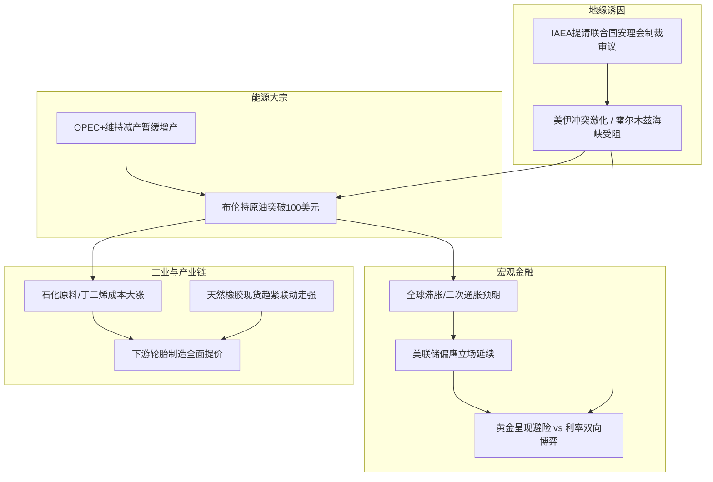

> 💡 **交互阅读提示**：以下要点均支持点击展开。点击各条要点标题即可展开查看详细解说、驱动机理与后续核心观测点；再次点击即可收起。

## 卷首总览

2026年9月上旬，全球政经格局迎来新一轮“地缘与商品”的共振冲击。中东冲突烈度骤升推动原油破百，并顺着产业链传导至化工与橡胶下游；避险与高利率预期则在高空撕扯黄金走势。以下将时政与大宗板块划分为六大核心要点，供快速查阅与深度推演。

---

## 🏛️ 第一板块：国际时政核心要点

<b>📍 要点一：美伊地缘摩擦急剧升级，IAEA涉核议题移交安理会</b>

### 【深度解说与背景】
- **事件脉络**：近日美军与伊朗在霍尔木兹海峡周边军事对抗显著升级。美军针对伊朗南部相关军事及基础设施发起打击，多艘油轮航运受到直接阻碍；与此同时，国际原子能机构（IAEA）理事会在9月9日投票决定，正式将伊朗“不遵守”《不扩散核武器条约》问题提交联合国安理会审议。
- **地缘实质**：中东关键能源航道的通航风险已从过去的“口头威慑与边际摩擦”，演变为实质性的航运阻断与军事介入风险。跨国航运巨头与保险机构对波斯湾区域的战险保费成倍跳升。
- **后续观测点**：
  1. 安理会是否会就新的制裁决议启动磋商，各常任理事国的外交博弈态势；
  2. 伊朗军方是否会采取更具实质性的封锁海峡或袭扰油轮行动。

<b>📍 要点二：第81届联大启幕与北极稀缺战略资源卡位</b>

### 【深度解说与背景】
- **多边治理困境**：联合国大会第81届会议正式开启。古特雷斯秘书长发出严厉警示，多点爆发的地缘武装冲突、核扩散临界点以及全球南北发展撕裂，正使二战建立以来的国际秩序承受巨大压力。
- **北极矿产争夺战略化**：欧盟委员会主席冯德莱恩前往格陵兰岛，宣布承诺向该地区投资2亿欧元。此举核心是绑定格陵兰岛丰富的稀土与关键工业矿产，建立独立自主的原材料供应链，直接应对大国在北极战略高地与深海/极地资源的抢跑布局。
- **后续观测点**：
  1. 欧美等主要经济体在关键矿产与清洁能源供应链上的“阵营化”壁垒变化；
  2. 上合组织等新兴经济体多边框架对全球治理改革方案的推进落地。

<b>📍 要点三：2026年中国服贸会开幕，高水平开放对冲逆全球化</b>

### 【深度解说与背景】
- **主场经贸动向**：2026年中国国际服务贸易交易会于9月9日至13日在北京首钢园召开，挪威作为主宾国参展。
- **现实意义**：在全球地缘摩擦此起彼伏、单边主义和贸易壁垒加剧的背景下，服务贸易、数字知识产权与跨境电商成为全球跨境资本与经贸交流的重要纽带，体现出在逆风中探索制度型开放的战略定力。

---

## 🛢️ 第二板块：大宗商品核心要点

<b>📍 要点四：【原油】布伦特突破100美元关口，供应中断担忧压倒需求疑虑</b>

### 【深度解说与背景】
- **价格异动**：布伦特原油期货价格两个多月来首次突破100美元/桶整数心理大关，美原油（WTI）亦攀升至95美元上方，刷新年内反弹高位。
- **核心驱动拆解**：
  1. **航运咽喉受阻**：霍尔木兹海峡每日承运全球近五分之一的原油海上贸易量，美伊摩擦使得油轮滞留风险陡增，地缘政治风险溢价被市场全力计入盘面；
  2. **OPEC+挺价不松手**：OPEC+核心产油国在9月初重申维持现有减产配额不变，暂不提前增产，导致全球原油供给端的安全缓冲垫（闲置产能与库存）处于极低水位。
- **后续观测点**：
  1. 波斯湾实际运力中断的持续周期，国际能源署（IEA）是否会考虑释放战略石油储备（SPR）；
  2. 高油价是否引发终端消费国更严重的通胀回潮与需求负反馈。

<b>📍 要点五：【黄金】避险买盘与高利率预期的剧烈多空拉锯</b>

### 【深度解说与背景】
- **价格异动**：国际现货与期货黄金在每盎司4400美元附近呈现剧烈宽幅震荡。
- **核心博弈机制**：
  1. **多头依托（避险底线）**：中东战火蔓延、核问题安理会化使得避险资金对黄金资产形成刚性托底；
  2. **空头压制（持有成本）**：美国近期非农及经济数据表现超出市场疲软预期，市场对美联储9月中旬利率决议维持偏鹰（甚至推迟降息/加息定价）的担忧急剧回升，美元指数走强对无息资产黄金构成直接压制。
- **后续观测点**：
  1. 9月中旬美联储FOMC政策声明与点阵图指引；
  2. 即将公布的美国最新CPI与PPI通胀读数。

<b>📍 要点六：【天然橡胶与合成胶】成本端上移驱动，轮胎产业启动多轮调价</b>

### 【深度解说与背景】
- **价格异动**：天然橡胶期货（上期所RU/INE NR）在现货支撑下保持强劲反弹，合成橡胶（顺丁、丁苯）受石化原料成本驱动出厂价密集上调。
- **产业链传导机理**：
  1. **上游原油暴涨**：石化原料（丁二烯、炭黑等合成橡胶基料）成本中枢迅速上移，合成胶被动大幅拉涨；
  2. **天然橡胶联动**：原产地东南亚近期部分割胶区域受局地天气扰动，同时海运物流保费上升拉长了进境周期，现货端可流通库存偏紧，支撑天胶跟随偏强；
  3. **下游传导**：原油与橡胶原材料成本的大幅上涨，直接倒逼国内及跨国轮胎生产企业发布9月新一轮产品提价函，全产业链成本转嫁逻辑正在兑现。
- **后续观测点**：
  1. 东南亚主产区旺产季的实际割胶天气与物候条件；
  2. 轮胎下游终端（主机厂与替换市场）对涨价的消化能力与出口集装箱运费变化。

---

## 🔗 宏观推演：跨资产传导链条

