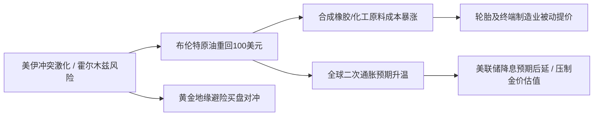

## 核心观察与导读

2026年9月上旬，全球政经格局迎来新一轮“地缘与商品”的共振冲击。中东地区冲突烈度急剧攀升，霍尔木兹海峡能源通道风险直接将布伦特原油期货推上100美元关口；与此联动，全球大宗商品链条迅速呈现**“原油领涨 ➔ 工业中间体与橡胶成本上移 ➔ 避险资产与流动性博弈加剧”**的连锁反应。

本文对当前国际时政关键走向及原油、黄金、天然橡胶等核心大宗商品市场的最新要点进行结构化速览。

---

## 一、 国际时政要点速览

### 1. 美伊地缘对抗急剧升级，涉核议题移交安理会
* **核心事件**：近日，美伊两国在霍尔木兹海峡周边的军事摩擦显著激化。美军针对伊朗南部相关设施实施军事打击，多艘油轮航运受阻；国际原子能机构（IAEA）理事会于9月9日正式投票，决定将伊朗“不遵守”核不扩散条约问题移交联合国安理会处理。
* **时政影响**：中东关键能源航道的通航风险已从“边际威慑”转化为“实质航运威胁”，跨国船东与保险机构大幅提升波斯湾保费，全球对中东能源断供的恐慌情绪再度蔓延。

### 2. 多极化治理与战略矿产博弈深化
* **联大第81届会议启幕**：联合国秘书长古特雷斯向全球发出警示，多点地缘冲突、核升级风险与不平等加剧正使二战以来的多边体系承受空前压力，呼吁各方通过外交机制重塑信任。
* **欧盟加码北极与格陵兰布局**：欧盟委员会承诺投入2亿欧元深化与格陵兰岛的经济合作，核心旨在锁定稀土与关键原材料供应链，应对大国在北极战略高地与矿产资源上的持续竞逐。
* **上合组织比什凯克峰会**：多国元首围绕全球治理改革阐明方案，强调推进平等有序的世界多极化与包容性普惠经济秩序。

### 3. 全球经贸合作主场开启
* **2026年中国服贸会**：9月9日至13日在北京首钢园举行，挪威担任主宾国。在全球地缘摩擦与单边关税抬头的背景下，服贸会聚焦高水平对外开放与服务贸易数字化创新，成为全球经贸交流的重要窗口。

---

## 二、 大宗商品市场要点速览

| 商品类别 | 当前关键动态 | 核心驱动因子 | 后续关键观察点 |
| :--- | :--- | :--- | :--- |
| **原油 (Crude Oil)** | 布伦特破100美元/桶，WTI逼近95美元 | 霍尔木兹海峡通航受阻预期 + OPEC+暂缓增产 | 波斯湾实际运力受损度、安理会制裁动向 |
| **黄金 (Gold)** | 4400美元/盎司附近高位多空胶着 | 中东避险买盘与美联储鹰派利率预期双向拉扯 | 9月中旬美联储FOMC决议、美国最新CPI |
| **橡胶 (Rubber)** | 天胶期货现货普涨，合成胶出厂价提调 | 原油暴涨抬升合成中间体成本 + 现货供应趋紧 | 产区天气与割胶进度、下游轮胎开工率 |

### 1. 原油：地缘风险溢价全面计入，重回“百元时代”
* **盘面表现**：布伦特原油自7月以来首度站上100美元/桶，WTI原油创下逾三个月新高。
* **供需机理**：不仅霍尔木兹海峡受阻直接压制每日近两千万桶的原油物流，同时OPEC+主要产油国在9月初一致决定维持现存减产配额不变，暂缓增产投放。双重挤压使得全球原油供给弹性降至阶段性低谷。

### 2. 黄金：地缘避险与流动性紧缩的高空拉锯
* **盘面表现**：国际金价在每盎司4400美元区间维持高波动率，多空分歧巨大。
* **博弈逻辑**：
  * **支撑端**：中东突发战事刺激全球主权基金与避险买盘坚决托底；
  * **承压端**：美国近期公布的劳动力市场数据依然展现韧性，推高了市场对美联储9月利率决议维持强硬姿态的押注。持金的机会成本对金价上攻构成直接抑制。

### 3. 天然橡胶与工业链：成本自上而下传导，轮胎行业再度跟涨
* **盘面表现**：国内天然橡胶期货（RU/NR）现货价格强劲反弹，合成橡胶出厂指导价同步上修。
* **产业传导**：
  * 原油重返高位直接推高丁二烯、炭黑等合成橡胶及配合剂的上游化工成本；
  * 成本抬升倒逼全钢、半钢轮胎制造企业在9月启动新一轮价格上调；
  * 原产地方面，近期部分产区天气因素扰动现货流转，海外进境物流周期拉长，供需基本面短期出现阶段性紧平衡。

---

## 三、 逻辑串联与跨资产推演

从当前各板块的共振脉络来看，市场的核心主线依然是**“地缘冲击 ➔ 供给收缩 ➔ 工业通胀”**：

* **宏观资产配置启示**：原油作为“大宗之王”，其价格突破直接激活了全产业链的滞胀交易逻辑。如果中东冲突局限于海峡局部摩擦，高油价将主要体现为结构性成本转嫁；一旦安理会进程演化为全面禁运或冲突扩大，全球能源危机预警将重新摆上各国议程。
