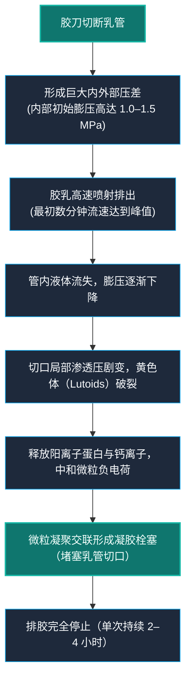

# 1.2 橡胶的自然属性：乳胶是什么？橡胶树为什么会"流泪"？

> *在上一节中，我们见证了巴西橡胶树如何在亚马逊雨林的残酷竞争中孕育出独特的乳管系统。然而，当我们走出幽暗的密林，将这一滴滴乳白色的汁液置于物理学、胶体化学与生物力学的显微镜下，一个更加不可思议的微观奇迹才真正展现在眼前。*

---

## 乳管的精巧构造：树皮下的独立管网

在 1.1 节中我们已经知晓，流淌的乳胶并非树木运送营养的"血液"，而是封存于专门管道中的分泌物。但如果我们在高倍显微镜下切开橡胶树皮，这套管网的精妙程度依然令人叹为观止。

一棵成熟的橡胶树干内部，实际并行运转着三套互不相通的流体网络：
1. **木质部导管**：位于树干深处木质层，承担"自来水管"的功能，单向将土壤中的水分与无机盐向树冠抽取；
2. **韧皮部筛管**：位于树皮内侧，承担"养分干线"的功能，双向调配叶片光合作用生成的蔗糖与氨基酸；
3. **特化乳管系统（laticifer）**：镶嵌在次生韧皮部（secondary phloem）中，与前两者物理隔离，是一套时刻处于封闭高压待命状态的"专属消防系统"。

更神奇的是乳管的空间几何构型。橡胶树的乳管由成千上万个乳管细胞在发育过程中纵向融合、侧向贯通而成，形成一种互联互通的**合胞体管网（articulated laticifer network）**。在显微解剖中可以发现，这些管网并非笔直向下延伸，而是以与树干纵轴呈 **3° 至 7° 的微小倾角，呈现右旋螺旋状向上攀爬**。

这个微小的螺旋角度，决定了现代橡胶种植业的核心农艺——**割胶刀法**。

胶工在割胶时，胶刀绝不能沿垂直方向切割，也不能水平环剥，而是必须**从左上方向右下方、以约 30° 的倾斜角由浅入深划开树皮**。由于割线方向几乎垂直于螺旋上升的乳管走向，这一刀法能够以最小的树皮创伤面积切断最多数量的乳管网，从而引出最大胶乳流量。

---

## 胶体化学：一滴乳胶的微观平衡与凝固密码

从割口流出的新鲜乳胶，在化学上属于一种高度复杂的**多分散疏水胶体乳浊液**。在肉眼看来它与牛奶无异，但在微米尺度下，它是一座动态平衡的微观微粒世界。

一滴新鲜乳胶的典型成分如下表所示：

| 成分 | 含量（重量百分比） | 生理与工业角色 |
|------|---------------------|----------------|
| **水** | 55%–65% | 胶体分散相介质，承载溶质运移 |
| **橡胶烃（聚异戊二烯）** | 30%–40% | 弹性本体，以微粒形式悬浮 |
| **蛋白质** | 1.5%–2.0% | 包裹于微粒表面提供电荷与空间位阻；亦含活性酶 |
| **脂类（磷脂、脂肪酸）** | 1.0%–1.5% | 构成微粒外层双分子膜，赋予界面亲水性 |
| **糖类与醇类** | 0.5%–1.0% | 树木代谢养料（奎尼醇等），亦是杂菌发酵碳源 |
| **无机盐与灰分** | 0.5%–0.8% | 维持离子强度与渗透压（钾、磷、镁离子） |
| **微量次生代谢物** | 微量（<0.5%） | 萜类、酚类、生物碱等化学防御成分 |

在这滴液体中，无数直径在 0.02 至 3 微米之间的**橡胶烃微粒**静静悬浮。核心是由纯净高分子构成的疏水内核，而表面则被一层极其关键的**蛋白质-磷脂双分子亲水膜**包裹。

这层薄膜为每一个橡胶微粒赋予了约 -30 至 -40 毫伏的**表面负电荷（Zeta 电位）**。在同性电荷的静电斥力以及水化蛋白层的空间位阻双重保护下，橡胶微粒相互碰撞却不会粘连聚结，从而让浓稠的高分子溶液能够像水一样顺畅流动。

然而，这套脆弱的胶体平衡只要离开树体就会迅速崩塌：
- **自然酸败凝固**：暴露于空气中的乳胶会迅速滋生野生菌群，细菌大量代谢糖类产出挥发性有机酸，使得胶乳体系的 pH 值从新鲜时的弱碱性（约 6.8–7.2）急剧滑落至蛋白质的**等电点（pH 4.5–4.8）**。此时，表面负电荷被氢离子彻底中和，水化保护层瓦解，橡胶微粒在范德华力作用下不可逆地抱团交联，析出为坚硬的生胶块。
- **工业抗凝保鲜**：为了在漫长的公路运输中保持液态，胶工收集新鲜胶乳后会立刻注入适量的**氨水（稀氨保鲜技术）**。氨水不仅能强力杀灭杂菌、阻止产酸发酵，更能稳定碱性环境（维持 pH > 10），强化微粒表面的负电荷斥力。这项看似平淡无奇的胶体化学应用，正是整个热带种植园乳胶得以远销全球各大港口的产业基石。

---

## 聚异戊二烯：弹性的物理与热力学真相

当乳胶凝固、脱水，剩下的橡胶烃微粒便相互融合成我们所熟悉的固体天然橡胶。为什么这种固体拥有任何金属、木材或岩石都无法企及的超级弹性——能被拉伸至原长的 700% 到 900% 却瞬间回弹如初？

答案藏在它的分子构型与热力学机制之中。

### 1. 完美的"顺式"链条
天然橡胶的化学本体是**聚异戊二烯（polyisoprene，化学式 [C₅H₈]ₙ）**，聚合度高达数千至数万，分子量常在数十万乃至上百万之间。

决定其物理特性的灵魂在于**立体异构性**：
- **顺式-1,4-构型（天然橡胶）**：主链上双键两侧的碳链骨架位于同一侧。这种不对称的弯曲构型破坏了分子排列的规整性，导致其在室温下无法紧密结晶，玻璃化转变温度低至 **-70°C**。在常温下，长链分子呈现为极度柔软、相互穿插蜷曲的**无规则线团（random coils）**。
- **反式-1,4-构型（古塔波胶 / 杜仲胶）**：与之相对，如果双键两侧的碳链位于异侧，分子链便呈规整的平直锯齿状，极易紧密堆积结晶。因此反式聚异戊二烯在室温下坚硬刚韧、几乎没有弹性（历史上曾用于制造高尔夫球外壳和海底电缆绝缘层）。

大自然在巴西橡胶树中实现了接近 100% 的顺式纯度，这使得分子链具备了无与伦比的自由摆动空间。

### 2. 熵弹性：来自热力学的弹力
普通固体材料（如钢铁弹簧）的弹性属于**能量弹性**——拉伸时强行拉开原子间的化学键，产生势能储存，松手时靠势能回复。

而橡胶的弹性则是奇妙的**熵弹性（Entropy Elasticity）**：
- 当橡胶处于静止未受拉伸状态时，数以万计的长链在热运动驱动下蜷缩缠绕，微观构象数量极大，体系处于**最大熵状态**（热力学最混乱、最稳定的状态）；
- 当你施加外力拉伸橡胶时，分子链被强行拉直、取向平行排列，微观构象急剧减少，体系的**熵值被迫下降**；
- 一旦外力撤除，分子内部的热运动会本能地驱动链段重新恢复混乱无序，产生强烈的宏观回缩力——**拉开橡胶的不是化学键的形变，而是热力学第二定律要求熵增的永恒冲动**。

### 3. 生胶的致命弱点与交联的诞生
然而，大自然赋予天然生胶的熵弹性并不完美。未加工的天然生胶分子链之间仅仅依靠微弱的范德华力相互维系，**缺乏永久性的化学交联点**。

这带来了19世纪初困扰整个西方工业界的噩梦——**热粘冷脆**：
- 温度升高时，热运动能量超过分子间作用力，分子链开始发生不可逆的相互滑移，橡胶失去弹性，变成一滩黏滞恶臭的软泥；
- 温度降低时，分子链的热运动停滞，链段被冻结在固定位置，橡胶变得像玻璃一样脆弱，稍受冲击便应声碎裂。

这个致命缺陷，直到1839年查尔斯·固特异（Charles Goodyear）发现了**硫化技术**——利用硫原子在平行的聚异戊二烯分子链之间架设永久性的"硫桥"（交联网络），才彻底被克服。硫化后的分子网既保留了分子链舒展蜷曲的熵弹性，又阻止了链条间的相对滑移，终于使橡胶化身为现代工业不可或缺的超级工程材料。

---

## 进化谜题：橡胶树为什么产生乳胶？

在 1.1 节中我们谈到，乳胶本质上是树木抵御外敌的一种自卫"创可贴"。然而从植物生理学与能量代谢的角度看，这个现象远比想象的要反直觉。

合成聚异戊二烯需要消耗极其庞大的能量与光合产物——每合成一分子异戊二烯单体，都需要消耗大量的乙酰辅酶A、ATP 和还原力 NADPH。在旺盛产胶期，橡胶树甚至要将自身光合作用同化总碳量的 **5% 至 10%** 全部投入到乳管代谢中。

在演化尺度上，植物绝不可能为了微不足道的理由长期承担如此沉重的代谢负担。科学界对橡胶树"流泪"的深层驱动机制，总结出四种递进的假说：

### 1. 物理防御：兼具堵漏与机械陷阱
最直接的功能是微观层面的物理防护。高浓度的乳胶在接触空气后迅速脱水凝集，不仅能快速封闭树皮创面、阻断水分蒸发，更对啃咬树皮的小蠹虫、天牛等钻蛀昆虫形成致命打击。高黏度的胶乳在几秒钟内便会裹住昆虫的口器与步足，像速干水泥一样将其困死在伤口表面。

### 2. 生化武器库：针对性分子反击
现代蛋白质组学研究表明，乳胶不仅是一张物理捕虫网，更是高度专业化的化学防御中心。乳胶中高丰度表达着一系列极具杀伤力的生物活性分子：
- **橡胶素（Hevein）**：一种富含半胱氨酸的小分子几丁质结合蛋白，能特异性结合真菌细胞壁的主要成分——几丁质，直接抑制真菌菌丝的萌发与扩展；
- **植物几丁质酶与 β-1,3-葡聚糖酶**：能够水解昆虫外骨骼和病原真菌细胞壁的双重水解酶系；
- **凝集素与次生代谢物**：乳胶中富含的萜类衍生物和酚类复合物具有强烈的拒食性与消化酶抑制作用，能让摄食树皮的昆虫消化道功能紊乱。

### 3. "安全隔离仓"假说（代谢副产物解毒）
植物缺乏动物的排泄器官，在复杂的次生代谢（如萜类、类固醇合成）过程中，会不可避免地产生大量具有细胞毒性的副产物。有学者指出，密闭且与主导管隔离的乳管系统，可能同时扮演了细胞的"安全隔离仓"或"化学垃圾桶"角色——植物将高活性、难处理的异戊二烯多聚体封存在特化细胞内部，避免其对进行旺盛光合作用与细胞分裂的正常组织造成代谢中毒。

### 4. 协同进化的军备竞赛
目前生态学界的共识是：**乳胶并非单一功能的产物，而是数百万年来热带雨林激烈生态对抗下的演化集大成者**。亚马逊雨林潮湿闷热的环境滋生了地球上最密集、最具侵略性的真菌与植食性昆虫种群，正是这种永不停歇的外部生存压力，逼迫橡胶树将物理封堵、化学毒杀与代谢隔离融为一体，演化出了这套看似昂贵、实则不可或缺的终极生存装甲。

---

## 排胶力学：高压喷涌与黄色体的"急刹车"

既然乳胶是如此珍贵的防御物资，橡胶树在遭受割伤时，又是如何控制排胶、避免自身"失血过多"而亡的？

这涉及一套精密精巧的流体生物力学机制。

### 1. 轮胎数倍的高膨压喷射
在树皮未受破损前，封闭的乳管细胞依靠细胞内液的高渗透势，维持着高达 **10 至 15 个大气压（约 1.0 至 1.5 MPa）** 的极高**膨压（turgor pressure）**。这个压力甚至比普通的家用轿车轮胎胎压高出4到6倍。

当胶刀锋利的刀尖切断微细乳管的刹那，管内外瞬间形成巨大的压力阶差，被压缩在管网中的乳胶在毫秒级时间内被猛烈地"挤射"而出。在割胶刚开始的几分钟内，乳胶呈现极高的初始流速。

### 2. 黄色体破裂：大自然的止血凝血带
如果高压喷涌无休止地进行下去，橡胶树将在几个小时内耗尽自身储备、脱水枯竭。阻止这一切的，是乳胶中一种被称为**黄色体（lutoid）** 的特殊细胞器。

黄色体是一种由单层生物膜包裹的微型液泡结构。在排胶过程中，随着乳胶大量外流，乳管内膨压急剧跌落，切口附近的渗透压与剪切力发生剧变，导致脆弱的黄色体膜发生物理性破裂。

黄色体破裂后，会向周围水相介质释放出两样关键武器：
- **带强正电荷的酸性蛋白质（黄色体蛋白）**；
- **高浓度的游离钙离子（Ca²⁺）与金属阳离子**。

这些带正电荷的物质如同精准的中和剂，瞬间抹去了橡胶微粒表面的负电荷屏障，破坏水化层，诱发局部的微观絮凝。在几十分钟到两三个小时的递进发展下，切口内侧逐渐形成由凝固橡胶烃交织而成的致密网状栓塞——**封堵切口乳管端口**。

随着切口被凝胶严密堵塞，乳胶流速缓缓衰减归零。整个排胶过程一般持续 **2 至 4 小时**，单株成年橡胶树每次排胶约 **50 至 100 毫升**。橡胶树由此完成了自我止血，并开始在树皮内部重新合成前体物质，酝酿下一次的防御待命。

---

## 自然界中的乳胶植物：为何唯独它登顶王座？

产生乳胶（分泌白色或有色乳汁）并不是巴西橡胶树独有的专利。据统计，被子植物门中有超过 **12,000 种植物** 演化出了能够分泌乳胶的解剖结构，横跨 20 多个科、数百个属：

| 代表植物 | 所属科 | 乳胶特点与人类利用历史 |
|----------|--------|------------------------|
| **蒲公英**（特别是俄罗斯蒲公英 *T. kok-saghyz*） | 菊科 | 根部富含橡胶烃，二战期间被苏联和美军紧急开辟为战略替代橡胶来源 |
| **银胶菊**（*Parthenium argentatum*） | 菊科 | 生长于北美干旱荒漠，乳胶致敏蛋白极低，用于制造高等级医疗手套 |
| **印度榕 / 印度橡胶树**（*Ficus elastica*） | 桑科 | 19世纪欧洲最早尝试商业提取的产胶植物之一，后因含胶率低、树脂杂质过多被废弃，今多为室内观赏绿植 |
| **人心果**（*Manilkara zapota*） | 山榄科 | 乳汁干燥后得到"糖胶树胶（Chicle）"，曾是传统口香糖的弹性胶基核心原料 |
| **罂粟**（*Papaver somniferum*） | 罂粟科 | 乳胶富含吗啡、可待因等异喹啉类生物碱，干燥后即鸦片，专司神经毒杀防御 |
| **夹竹桃**（*Nerium oleander*） | 夹竹桃科 | 乳汁含有剧毒强心苷（夹竹桃苷），是高效的脊椎动物与昆虫强效毒杀剂 |

横向对比可以发现，大自然在不同植物体内，为乳汁配置了截然不同的化学底色：有的充斥着生物碱毒素，有的混合着黏稠糖胶，有的合成低分子量树脂。

然而，在成千上万种能够合成橡胶烃的植物中，唯独**巴西橡胶树（*Hevea brasiliensis*）** 最终统治了全球工业界。这是因为它极其罕见地同时满足了现代工业化采集的**四大苛刻指标**：
1. **超高的含胶丰度**：新鲜乳胶中橡胶烃含量稳定高达 30%–40%，远超其他植物（如蒲公英根部仅 5%–10%）；
2. **极高的顺式纯度**：顺式-1,4 构型纯度接近 100%，赋予其极低内耗与近乎完美的熵回弹性；
3. **巨大的聚合物分子量**：重均分子量高达 100 万至 250 万道尔顿，形成了极其坚固的物理缠结与力学强度；
4. **独特的创伤排胶生理**：乳管系统具备连通性网状结构与高膨压，树皮受创后能自主持续排胶长达数小时，且具备极强的创面再生与乳胶再生能力，使得人类可以在同一棵树上持续定期割胶长达 30 年以上。

大自然用上万种植物尝试了乳胶的防御可能，却只在亚马逊雨林的深处，锻造出这一件兼具超凡产胶量与无瑕力学品质的生物学孤品。

---

## 小结

透过显微镜与物理化学的视角，我们看清了橡胶的真正本质：
它绝非平平无奇的树木汁水，而是一套集**微米级胶体平衡、分子级高熵弹性、兆帕级生物膨压**以及**精准自限凝血机制**于一体的自然杰作。

在橡胶树身上，这是千万年残酷生存斗争锻造的坚固盾牌；但当这种大自然精雕细琢的超级材料走出雨林，它所蕴含的高弹性、高韧性与不透水气之物理特性，注定将成为打破工业文明材料瓶颈的一柄利剑。

而在人类真正涉足亚马逊、用胶刀开启工业时代之前，橡胶树自身的远古祖先，又在地球的地质年代中走过了怎样漫长的岁月？

---

*下一节：[1.3 远古时代的橡胶：化石记录与植物进化]*
