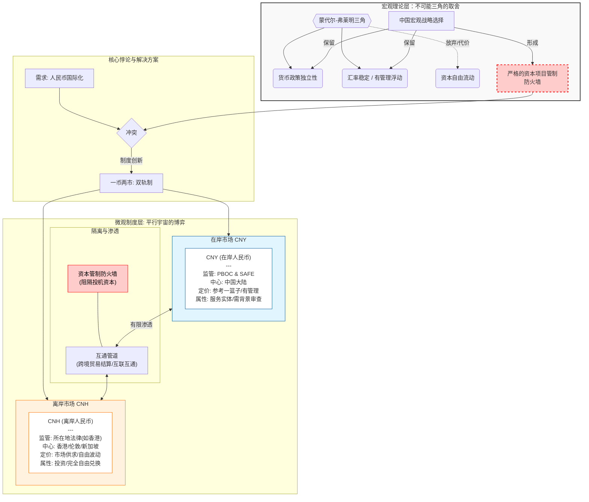

## **1\. 核心摘要 (Executive Summary)**

在全球货币体系多极化演进的宏观背景下，离岸人民币（CNH）作为中国在维持资本账户管制与推进本币国际化之间寻求平衡的制度创新，成功构建了兼具主权货币属性与离岸自由浮动特征的“一币两市”金融双轨制格局。本研究深入探究了离岸人民币的底层逻辑，系统剖析了在岸人民币（CNY）受控浮动与离岸人民币（CNH）完全市场化定价之间的内在博弈。研究表明，由于境内外市场的准入壁垒与流动性阻断，两者在汇率与利率层面长期存在结构性价差，这种价差不可避免地催生了基于跨境贸易通道（如“保税区一日游”）与跨境信用担保（如“内保外贷”）的复杂套利网络。通过将离岸人民币与历史上的“欧洲美元”（Eurodollar）、“离岸日元”（Euroyen）以及新兴市场“无本金交割远期”（NDF）进行多维度横向对比，本文揭示了离岸人民币由“国家顶层设计驱动”而非纯市场自发演进的独特演化路径。展望未来，随着多边央行数字货币桥（mBridge）等金融基础设施的全面商用，离岸人民币的清算逻辑将被底层重构，数字人民币的“可编程护栏”将在保障国家货币主权的同时，进一步拓展人民币在全球贸易与投融资网络中的战略纵深。

## **2\. 背景与定义 (Background & Definition)**

探究离岸人民币的本质，必须将其置于国际宏观经济学的经典理论框架——蒙代尔-弗莱明“不可能三角”（Mundell-Fleming Trilemma）之中。该理论明确指出，一个经济体无法同时实现资本自由流动、货币政策独立性以及汇率稳定。作为全球第二大经济体，中国为了在复杂的外部冲击中维持宏观经济的平稳运行，坚定选择了保持货币政策的绝对独立性，并实行以市场供求为基础、参考一篮子货币进行调节、有管理的浮动汇率制度。这一战略选择的必然代价，便是必须实施严格的资本项目管制，构筑起阻隔国际投机资本的“防火墙” 。  
然而，2008年全球金融危机的爆发深刻暴露了以单一美元霸权为核心的国际货币体系的极度脆弱性。为了降低对外贸易中的汇率风险与美元依赖，中国政府启动了人民币国际化战略。但这一战略面临着一个核心悖论：如何在不打破国内资本管制防火墙的前提下，让人民币在国际市场上被广泛接受、持有并用于交易？这一历史性难题催生了“离岸人民币市场”的诞生。自2003年香港获批试办个人人民币业务起步，至2009年跨境贸易人民币结算试点正式推行，再到2010年香港正式推出可自由报价和交易的离岸人民币（CNH）市场，中国走出了一条极具东方智慧的“一币两市”制度创新之路 。  
在这一双轨制架构下，人民币被赋予了两个截然不同的金融契约标识与流通属性。在岸人民币（CNY）是指在中国大陆境内发行、流通和交易的主权法币，其主要服务于国内实体经济、企业间交易、个人消费以及受严格配额管理的跨境投融资活动。在岸市场的核心特征是受到中国人民银行（PBOC）及国家外汇管理局（SAFE）的全面、严格监管，资金的跨境进出必须满足真实的贸易背景审查或遵循特定的资本项目额度限制。相对而言，离岸人民币（CNH）泛指在中国大陆境外流通和交易的人民币资金池。最初以香港（Hong Kong）为核心节点（代码后缀H由此而来），随后迅速辐射至新加坡、伦敦、法兰克福等全球主要离岸金融中心。离岸人民币不受中国国内资本管制的直接法律约束，在离岸市场上可以与其他国际货币进行完全自由的兑换、借贷与衍生品交易，其流转遵循所在离岸金融中心的法律与监管框架 。  
这一物理上的隔离与制度上的分野，使得CNY与CNH虽然在主权信誉上同根同源，但在微观市场结构、参与主体画像以及价格决定机制上，演变成了两个高度关联却又相互博弈的平行宇宙。

## **3\. 深度剖析 (Deep Analysis)**

### **3.1 汇率定价机制与市场决定因素的异质性**

在岸人民币与离岸人民币最核心的差异，集中体现在其汇率定价机制的行政干预程度与市场化深度的结构性分野上。  
在岸人民币（CNY）的汇率形成机制具备显著的“受控稳定”特征。中国人民银行作为唯一的主导性监管者，通过每日早盘发布人民币兑美元汇率中间价，为全天的外汇交易设定了“价格锚”。根据现行制度，境内银行间即期外汇市场的人民币兑美元交易价只能在中间价上下百分之二的特定幅度内浮动 。这种机制的设计初衷在于熨平短期市场的非理性波动，防止投机性资本通过汇率通道对国内金融体系稳定性造成冲击。境内市场的参与主体主要为国内商业银行、进出口企业以及部分经过严格审批的合格境外机构投资者（QFII/RQFII）。由于资本账户尚未完全开放，境内的外汇供求在很大程度上是由真实的货物贸易与服务贸易项下的结售汇需求所主导的，这使得CNY的汇率走势往往能够较为平稳地反映中国宏观经济的基本面与央行的政策意图 。  
与此形成鲜明对比的是，离岸人民币（CNH）展现出了高度市场化的“自由博弈”属性。离岸市场的汇率形成机制与美元、欧元等成熟的国际储备货币完全一致，不受任何涨跌幅区间的行政限制，其价格走势完全交由全球外汇市场的供求关系、国际投资者的宏观风险偏好以及全球资本的流动性状况来决定。离岸市场的参与者生态极具多样性与攻击性，汇聚了跨国公司、境外商业银行、国际大型投行、对冲基金甚至高频交易商（PTFs）。当国际市场上出现影响中国经济前景的重大突发事件、地缘政治摩擦加剧、或是中美利差发生显著倒挂时，由于国际资本无法自由进出在岸市场进行对冲，他们会迅速且集中地在离岸市场抛售或买入CNH资产 。  
这种不同的市场微观结构导致了两者在面对外部冲击时的敏锐度存在极大差异。CNH因其完全的自由兑换与无摩擦的交易机制，通常被国际金融界视为观察全球市场对中国资产信心以及人民币汇率走势的最敏感的“晴雨表”与前瞻性指标。而在极端市场情绪下，离岸市场的高波动性往往会通过预期引导的方式，对在岸市场的中间价定价产生倒逼压力。

### **3.2 在岸与离岸市场的联动博弈与溢出效应**

尽管在岸与离岸市场被资本管制的防火墙物理阻隔，但两者绝非完全孤立的封闭系统。伴随跨境贸易人民币结算规模的持续攀升、离岸点心债（Dim Sum Bonds）市场的扩容以及“沪深港通”、“债券通”、“互换通”等互联互通机制的深化，CNY与CNH市场之间已经形成了错综复杂的反馈闭环与溢出效应。  
国际货币基金组织（IMF）的相关学术研究通过双变量GARCH（广义自回归条件异方差）模型，对在岸与离岸人民币市场的价格发现功能进行了量化分析。研究证据深刻揭示了两个市场之间不对称的交互影响机制：在即期汇率（Spot Rate）层面，由于在岸市场背靠中国庞大的实体经济与进出口贸易基数，CNY的现货市场发展更为成熟且深度更深，因此在岸即期汇率通常对离岸即期汇率发挥着基础性的价格引导作用。离岸即期价格的波动往往是围绕着在岸价格这一中枢进行的均值回归。然而，在远期汇率（Forward Rate）与衍生品定价层面，情况则完全逆转。由于离岸市场聚集了大量具备复杂对冲需求与投机动机的国际金融机构，加之离岸衍生品工具更加丰富且交易无限制，离岸远期汇率（CNH Forwards）及无本金交割远期（NDF）对未来汇率走势的反应速度远快于在岸市场。实证数据表明，离岸远期汇率对在岸远期汇率具有显著的预测性冲击和单向溢出效应 。  
这种双向的跨市场溢出效应意味着，当国际资本看空人民币时，离岸市场的抛压会导致CNH迅速贬值，使得CNH汇率大幅偏离CNY汇率，形成显著的汇差。这种价差不仅会扭曲市场预期，还会引发更大规模的跨境套利资本流动，进而迫使中国央行不得不在必要时通过收紧离岸人民币流动性（例如在香港市场发行央行票据，推高CNH HIBOR利率以增加做空成本）等宏观审慎工具，对离岸市场进行隐性干预与预期管理 。

### **3.3 汇差与息差驱动下的跨市场套利机制深度还原**

在岸与离岸人民币市场的分割，必然导致同一主权货币在不同司法管辖区内出现两种截然不同的价格（汇率差）与资金成本（利率差）。在逐利本能的驱使下，跨国企业与金融机构利用现有的经常项目通道或跨境融资政策的监管缝隙，构建了极其精妙的跨市场套利（Arbitrage）模型。这种套利行为不仅是微观主体的理性财务决策，更是促使两地市场价格趋向收敛的重要市场化力量。

| 套利驱动核心 | 代表性套利策略 | 资金流转与操作路径简述 | 主要限制因素与摩擦成本 |
| :---- | :---- | :---- | :---- |
| **汇率差 (CNY ≠ CNH)** | “保税区一日游”转口贸易套利 | 虚构或利用高附加值微型商品（如芯片）在保税区与境外频繁进出，通过境内低价买入美元、境外高价抛售美元循环赚取汇差。 | 海关真实性核查、高昂的进口增值税及物流仓储费用。 |
| **利率差 (SHIBOR ≠ HIBOR)** | “内保外贷”跨境息差套利 | 境内企业存入高息人民币存款开立备用信用证，境外关联公司凭证在离岸获取低息人民币/外币贷款，赚取境内外资金利差。 | 银行担保费率、外汇局对外汇担保履约的严格审批。 |
| **综合资金池管理** | 跨国公司跨境双向人民币资金池 | 利用集团内外管局核批的资金池额度，根据境内外汇率与利率的实时窗口，在境内主账户与境外子账户间自由调拨头寸。 | 政策规定的净流入/流出上限额度、资金池归集政策的合规审计。 |

#### **3.3.1 汇差套利：以真实或构造贸易为掩护的资金腾挪**

当离岸市场与在岸市场的人民币汇率出现显著背离时（银行业内实务经验表明，当两地汇率价差超过500个基点，即0.05元人民币时，套利窗口即被打开），拥有真实贸易背景或涉外业务渠道的企业便会启动汇兑套利机器 。  
以离岸人民币（CNH）相对在岸人民币（CNY）出现大幅升值（即在离岸市场人民币更值钱，能换到更多美元）的宏观场景为例。境内企业A可以通过向其位于香港的关联公司B发起一笔进口业务，将境内的人民币资金以较低的在岸汇率输出至香港账户；随后，香港公司B利用离岸市场的汇率优势，将这笔人民币以较高的CNH汇率兑换成美元；紧接着，B公司再通过反向贸易（如向A公司出口商品），将兑换所得的美元货款支付回境内；最后，境内企业A收到美元后，按照在岸汇率结汇回人民币。经历这一完整的跨境资金循环，企业在未承担任何敞口风险的情况下，无风险地攫取了两地市场的汇率差额 。  
为了规避国家外汇管理局对无真实贸易背景资金跨境的严厉打击，套利企业在实操中往往展现出极高的隐蔽性。他们倾向于选择黄金、高端电子元器件等体积微小、单体价值极高且物流成本相对低廉的商品作为物流载体。更有甚者，利用国家赋予保税区、出口加工区等特殊经济区域“境内关外”的监管便利，境内企业与境外关联企业频繁构造金额对等、方向相反的国际贸易流水，商品仅在保税区内“一日游”甚至不发生实质性的物理位移，纯粹通过单证的流转实现境内购汇、境外结汇的资金套利闭环 。

#### **3.3.2 息差套利：“内保外贷”与跨境资金池的财务重构**

除了汇率波动，境内外宏观经济周期的错位导致了在岸利率（如上海银行间同业拆放利率 SHIBOR）与离岸利率（如香港银行同业人民币息率 HIBOR）之间长期存在利差，这构成了另一种极具吸引力的套利源泉。  
长期以来，得益于离岸市场缺乏存款准备金约束且全球流动性泛滥，离岸人民币的融资成本普遍低于在岸市场。这催生了盛极一时的“内保外贷”息差套利模式。在此模式下，境内企业首先在境内商业银行存入一笔高息的人民币定期存款或购买保本型理财产品，并以此作为质押抵押物，要求境内银行开具备用信用证（Standby Letter of Credit, SBLC）或跨境融资保函，并将其开给离岸关联企业所在的境外合作银行。境外企业凭借境内银行的信用背书，顺利在香港或新加坡获取低利率的离岸人民币或美元贷款。随后，这笔低息资金通过合规的经常项目或外商直接投资（FDI）渠道回流至境内使用。在这个精巧的结构中，企业不仅享受了境内高昂的理财收益，同时仅需支付境外低廉的贷款利息，只要两者之间的利差足以覆盖银行的开证担保费及资金过境的摩擦成本，企业即可实现规模化的息差套利收益 。  
近年来，随着中国稳步推进资本账户的高水平对外开放，跨国公司跨境双向人民币资金池政策在各大自贸区全面落地。大型跨国集团被允许在核定的净流入和净流出额度内，通过设立境内外资金主账户，实现全球资金的集中运营与调拨。这使得息差与汇差套利从边缘的“灰色地带”转变为跨国企业司库（Treasury）日常的、合法合规的全球流动性优化与财务成本控制手段，极大地平抑了境内外市场的极端价差 。

### **3.4 全球离岸货币体系的历史镜像与横向比较**

纵观全球金融史，离岸货币市场的出现绝非偶然，它们通常是严格的国内资本管制、悬殊的税制差异或地缘政治博弈的副产品。将离岸人民币（CNH）与历史上其他的离岸货币体系进行横向比对，能够更清晰地洞察人民币国际化的底层逻辑与独特演进路径。

#### **3.4.1 欧洲美元 (Eurodollar)：规避监管的市场自发产物**

欧洲美元市场是目前全球规模最庞大、流动性最为深厚的离岸货币体系，其泛指存放在美国境外的外国银行或美国银行海外分支机构的美元存款。该市场的诞生充满了戏剧性的历史巧合。二十世纪五十年代冷战初期，前苏联政府出于对其存放于美国本土的美元资产可能遭到美国政府冻结的深切担忧，将其持有的巨额美元头寸转移到了总部位于伦敦的欧洲银行系统。这笔“政治避险资金”构成了欧洲美元市场的初始流动性 。  
随后，美国政府在六十年代相继出台了旨在限制境内银行存款利率上限的“Q条例”（Regulation Q）以及旨在阻断资本外流的利息平衡税。面对严苛的国内金融压抑政策，具有高度敏锐嗅觉的美国本土银行和跨国财团纷纷将其信贷业务与资金池转移至不受美国国内法律管辖、且无需缴纳高昂存款准备金的伦敦金融城。因此，欧洲美元市场的崛起，本质上是私人资本为了规避母国监管（Regulatory Arbitrage）而进行的**完全由市场力量自发驱动**的离岸信用创造过程 。  
与此形成鲜明对照，离岸人民币（CNH）市场的建立则是一场典型的**国家意志与顶层设计的产物**。中国政府通过与各离岸中心所在的国家或地区签署双边本币互换协议、授权指定境外人民币清算行（如中银香港）、主动配发人民币合格境外机构投资者（RQFII）额度等一系列制度安排，有计划、有步骤地在海外搭建起了人民币的流通基础设施。CNH市场不仅没有脱离中国央行的宏观视野，反而通过政策渠道保持着与母国货币当局的紧密连接与隐性背书。

#### **3.4.2 离岸日元 (Euroyen)：本末倒置的开放教训**

二十世纪八十年代，日本在遭遇美国要求其承担更大国际责任及升值压力的背景下，对《外汇及外国贸易法》进行了颠覆性的修订，全面解除了资本项目管制，实现了日元在经常项目与资本项目下的完全可自由兑换。这一激进的金融自由化改革迅速催生了庞大的离岸日元（Euroyen）市场。  
然而，日本的货币国际化路径却遭遇了结构性的失败。相关宏观经济学实证研究指出，尽管离岸日元的资本交易规模呈指数级膨胀，但由于日本企业在国际贸易中高度依附于美国的供应链体系，缺乏以本币计价的绝对定价权，导致其在全球货物贸易结算中依然不可救药地依赖美元（即所谓的“贸易计价货币惯性”）。这种实体贸易基础与金融资本交易的严重脱节，使得离岸日元最终沦为了国际投机客进行日元利差交易（Yen Carry Trade）的纯粹金融工具，未能真正提升日本在全球经济格局中的核心竞争力。  
中国政策制定者深刻汲取了日本的教训。人民币的国际化选择了“贸易结算先行、离岸市场培育、资本账户谨慎开放”的稳健三步走战略。中国严格把控着资本账户的开放节奏，优先鼓励国内实体企业在进出口环节使用人民币进行真实贸易结算，以此为基础向境外输送人民币流动性。离岸人民币（CNH）市场首先服务于庞大贸易网络的汇兑与避险需求，在此基础上才稳步推出点心债等投资产品。这种“脱虚向实”的发展逻辑，确保了离岸市场规模的扩张始终锚定在中国实体经济的全球化进程之上。

#### **3.4.3 新兴市场无本金交割远期 (NDF)：缺乏现货深度的衍生品代偿**

对于韩国、马来西亚、印度尼西亚等实施外汇管制的新兴市场国家而言，其货币在境外的发展呈现出另一种特殊的离岸形态——无本金交割远期（Non-Deliverable Forward, NDF）市场。在1997年亚洲金融风暴之后，为了抵御国际索罗斯等量子基金的狙击，部分东南亚国家实施了严厉的资本冻结措施，并在法律层面彻底切断了本国货币在境外的物理交割与现货流通渠道。  
在缺乏离岸现货市场的情况下，为了满足跨国企业对冲汇率风险的刚性需求，国际投行在新加坡和伦敦等地创新性地推出了NDF合约。在这一机制下，交易双方在期初约定某个新兴市场货币兑美元的远期汇率，但在合约到期日，双方并不进行该新兴市场货币本金的实际交割清算，而是直接将到期日的市场实际即期汇率与合约约定汇率的差额，折算成自由兑换货币（通常为美元）进行净额现金结算 。  
与NDF这种带有强烈无奈色彩的纯粹金融衍生工具相比，离岸人民币（CNH）展现出了跨维度的制度优越性。CNH不仅拥有深度极佳的现货（Spot）交易市场，还配备了可全额交收的远期（Deliverable Forwards）、期权（Options）、外汇掉期（FX Swaps）以及多层次的固定收益债券体系。这种全功能、全链条的离岸货币生态，赋予了离岸人民币在充当全球贸易计价媒介与外汇储备资产方面的巨大战略潜能。

### **3.5 基础设施的底层重构与数字货币桥的破局**

离岸货币市场规模的上限，在很大程度上受制于底层清算基础设施的通达度与安全性。目前，全球离岸人民币的跨境调拨与清算高度依赖于SWIFT（环球银行金融电信协会）的报文传输网络，以及通过境外代理行连接至中国大额支付系统（CNAPS）的传统架构。  
根据国际清算银行（BIS）2025年发布的三年一度的外汇与衍生品市场报告，人民币在全球外汇日均交易量中的份额已历史性地跃升至8.8%，稳居全球第五大交易货币；而在细分的货币对交易中，美元/在岸人民币（USD/CNY）的交易量更是超越了英镑，成为仅次于欧元和日元的全球第三大活跃货币对，其中离岸市场（包括主要由高频交易商和对冲基金主导的香港和新加坡市场）贡献了巨大的流动性增量 。同步印证这一趋势的还有SWIFT系统最新发布的2025年12月人民币追踪报告（RMB Tracker），数据显示人民币在全球支付货币中的份额稳定在2.94%左右，而在全球贸易融资市场中，人民币的份额更是达到了6%至7%的高位水平，反映出其在服务实体跨境商贸中的绝对实力 。  
然而，传统代理行清算模式存在着链条冗长、清算效率低下、合规成本高昂等诸多痛点，更为致命的是，在日益复杂的地缘政治格局下，过度依赖西方主导的金融基础设施系统，使得离岸人民币网络面临极高的长臂管辖与制裁风险。  
在此背景下，进入2024至2025年，以中国央行发行的数字人民币（e-CNY）为核心的多边央行数字货币桥（Project mBridge）项目取得了颠覆性的战略突破。该项目由国际清算银行创新中心牵头，联合中国、香港特别行政区、泰国、阿联酋等央行共同研发，旨在利用先进的分布式账本技术（DLT），绕开传统的美元清算中间银行，实现多国央行数字货币的跨境点对点实时结算。  
截至2025年底的权威数据显示，mBridge平台的累计交易量已出现爆发式增长，达到了惊人的554.9亿美元，其中数字人民币（e-CNY）在总结算量中占据了超过95%的绝对主导地位 。这一数字基础设施的全面落地，正在从底层逻辑上重构离岸人民币的流动性运转机制。传统离岸市场的流动性依赖于跨国私人商业银行体系的信贷派生（如欧洲美元），而mBridge则通过联盟链的形式，将跨境支付轨道内化于由多国央行共同治理的公共网络之中。更为关键的是，数字人民币底层的智能合约技术能够实现资金流向与用途的“可编程护栏”（Programmable Safeguards），这使得中国央行不仅能够精准监控人民币在离岸市场的沉淀总量，杜绝大规模投机性囤积，还能在物理国界之外，构筑起一道基于底层代码逻辑的“数字国界线”（Digital Territorial Fix） 。这种将资本管控的宏观意图无缝嵌入跨境清算微观代码的做法，史无前例地化解了“既要防范风险传染，又要提供离岸流动性”的主权货币国际化悖论。

## **4\. 结论与展望 (Conclusion & Outlook)**

综上所述，离岸人民币（CNH）绝非国际货币体系演进的常态化产物，而是中国在面对蒙代尔-弗莱明“不可能三角”的残酷约束时，所进行的一场兼具实用主义与战略前瞻的制度创新。它犹如一座建立在资本管制防火墙外的高级金融离岛，既通过高度市场化、自由浮动的汇率定价机制，满足了全球跨国企业、金融机构在贸易清算、跨境投融资与外汇避险等方面的海量真实需求；又利用严格的境内外账户隔离与资金调拨监管，最大限度地缓冲了国际热钱与输入型金融危机对中国庞大且复杂的国内金融体系的直接冲击。  
在岸与离岸人民币之间由体制性阻断所衍生出的汇率差与利率差，在客观上催生了“保税区一日游”、“内保外贷”等错综复杂的跨市场套利行为。然而，从更深邃的经济学视角审视，这些套利资本正是促进价格发现、修复市场非理性预期的核心市场化力量，它们在灰色地带的持续博弈，倒逼着监管层不断优化外汇管理体制，推动着人民币定价机制的逐步成熟。对比欧洲美元的野蛮生长、离岸日元的产业脱节以及新兴市场NDF的虚无缥缈，离岸人民币走出了一条始终锚定实体贸易、坚持国家顶层设计与宏观审慎调控并重的发展道路。  
**未来展望：**  
首先，在经济基本面与金融开放维度的交汇点上，随着“债券通”、“互换通”等资本市场互联互通机制的持续扩容与深化，在岸与离岸市场的渗透率将大幅提升。在岸市场的深度与广度将进一步主导离岸市场的价格预期，CNY与CNH的汇率与利率走势将在长期动态博弈中呈趋同演化态势，极端情况下的结构性价差将日益罕见，传统的简单套利窗口将被逐步抹平。  
其次，在全球金融基础设施的范式转换中，多边央行数字货币桥（mBridge）的持续扩张与数字人民币（e-CNY）的跨境普及，将从根本上解构以SWIFT和美元CHIPS清算系统为核心的传统金融霸权。一种不依赖于庞大海外商业银行资金池、而是基于分布式账本和央行直接互信的“数字离岸人民币体系”正在加速成型。这将在大幅降低跨境贸易摩擦成本的同时，赋予中国货币当局对离岸资本流动更为精准的穿透式监管能力。  
最终，将时间轴拉长至宏观历史的维度，离岸人民币（CNH）这一带有深刻过渡期烙印的特殊代号，其终极历史使命是完成向人民币资本项目完全可自由兑换的平稳过渡。当中国经济的内生增长动力实现彻底转型，在全球高端制造产业链中掌握绝对的定价权，且国内金融体系具备了全面抵御外部周期性冲击的足够韧性之时，在岸与离岸的物理壁垒将被最终拆除。届时，CNY与CNH将完成历史性的合流，人民币将以完全统一的主权货币姿态，全面重塑全球国际储备与贸易结算的新格局。

## ---

**5\. 参考文献与注释 (References & Notes)**

Airwallex (空中云汇). (2024). 《离岸人民币（CNH）与在岸人民币（CNY）有什么区别？》.  
同花顺财经. (2025). 《CNH与CNY的核心区别》.  
Aspire. (2025). 《CNH vs CNY：监管机构与汇率形成机制及个人换汇注意事项》.  
中国经济网. (2016). 《离岸人民币与在岸人民币套利案例分析：虚假贸易与内保外贷息差套利》. （补充说明：文章详细拆解了企业如何利用汇差在500个基点以上的窗口期通过保税区转口贸易套利，以及利用离岸长期较低利率水平通过备用信用证进行息差套利的操作路径）。  
Bank for International Settlements (BIS). (2025). 《Triennial Central Bank Survey of Foreign Exchange and Over-the-counter (OTC) Derivatives Markets in 2025》. （补充说明：报告披露2025年4月新兴市场货币全球外汇交易份额升至29%，其中人民币占比跃升至8.8%，USD/CNY成为全球第三大交易货币对）。  
International Swaps and Derivatives Association (ISDA). (2025). 《RMB-Denominated IRD Growth Continues in Mainland China and Hong Kong》.  
Society for Worldwide Interbank Financial Telecommunication (SWIFT). (2025). 《RMB Tracker December 2025》. （补充说明：该官方追踪报告显示2025年11月人民币在全球支付货币中占比2.94%位居第六）。  
Deutsche Bank. (2025). 《Charting the Renminbi's rise as a global currency》. （补充说明：数据引证截至2024年底人民币占全球贸易融资份额达到6%，以及2025年4月SWIFT支付份额攀升至3.5%的强劲增长态势）。  
Official Monetary and Financial Institutions Forum (OMFIF). (2020). 《Eurodollar lessons for Hong Kong renminbi》. （补充说明：剖析了上世纪60年代欧洲美元基于规避美国Q条例的纯市场化自发起源，与中国强顶层设计驱动的离岸人民币形成鲜明对比）。  
Brookings Institution. (2016). 《China's Global Currency: Lever for Financial Reform》.  
Executives' Meeting of East Asia-Pacific Central Banks (EMEAP). (2015). 《Non-deliverable forward (NDF) markets》.  
Bank of Japan (BOJ) & Ministry of Finance Japan. (2000). 《Euroyen Market Developments and Capital Account Deregulation》.  
International Monetary Fund (IMF). (2012). 《Working Paper: Inter-linkages between onshore and offshore markets》. （补充说明：基于双变量GARCH模型的计量经济学研究，实证支持在岸即期汇率主导离岸即期汇率，而离岸远期汇率对在岸远期汇率具有显著预测效应的学术结论）。  
Atlantic Council. (2026). 《What to watch as China prepares its digital yuan for prime time》. （补充说明：揭示了截至2025年底数字人民币累计交易额超2.3万亿美元，以及mBridge项目交易量飙升至554.9亿美元且e-CNY占比逾95%的前沿数据）。  
涂永红 / 中国人民大学国际货币研究所. (2025). 《mBridge多边央行数字货币桥与离岸人民币市场影响分析》.  
DLAPiper. (2026). 《Official release of the 2025 cross-border cash pooling regulations》. （补充说明：涉及跨国公司跨境双向人民币资金池新规如何影响企业司库内部财务套利与资金归集的政策背景材料）。  
Bank for International Settlements (BIS). (2004). 《Asian non-deliverable forward markets》. （补充说明：用于界定存在资本管制的新兴市场如何被迫发展出现金交割的NDF市场，作为离岸人民币全功能现货市场的对标案例）。