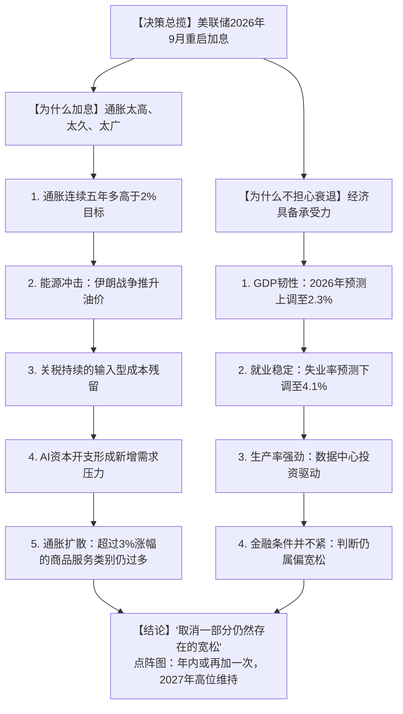
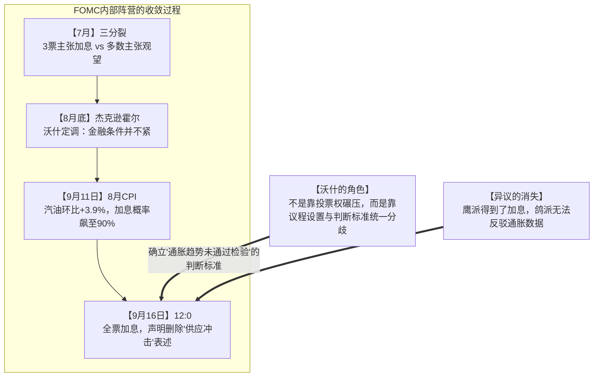
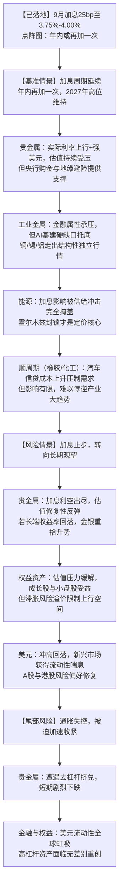

## **1. 核心摘要**

北京时间2026年9月17日凌晨，美联储用一次**12票赞成、0票反对**的全票决议，终结了市场持续数月的政策猜想：联邦基金利率目标区间由3.50%—3.75%上调25个基点至**3.75%—4.00%**。这是美联储**自2023年7月以来的首次加息**，也是凯文·沃什2026年5月就任主席以来首次改变政策方向。

图中是美国债务结构的恶化轨迹：2020年疫情期间的天量救助把联邦债务推上台阶，随后在高利率周期里，短期国库券（T-Bills）发行量井喷，大量滚动债务不得不以4%以上的利率在公开市场上借新还旧。利息开支已经成为联邦财政赤字膨胀的最主要推手，“财政主导（Fiscal Dominance）”对货币政策的隐性约束达到了半个世纪以来的顶峰——**但2026年9月的这次全票加息证明：至少到目前为止，财政压力还没有绑架货币政策。**

值得关注的并不是25个基点本身。沃什借此正式告诉市场：美国经济没有衰退，劳动力市场接近充分就业，金融条件也谈不上紧，而通胀已经连续五年多高于目标。**此前的观望期结束了，政策重心已重新转向抗击通胀。**

与此前市场普遍设想的剧本不同，美联储并没有走出一条“降息+缩表+财政货币新协议”的组合路径。执政四个月的沃什给出的答案相当“正统”：**通胀太高、太久，经济足够强，金融条件并不紧——所以把先前那一点点宽松收回去。** 他既没有立刻兑现白宫期待的降息，也没有同步启动激进缩表，而是选择了最传统、也最难被指责的工具：提高政策利率。

本文旨在系统回答四个核心问题：
1. **美联储本轮政策周期究竟处于什么位置？为什么会在2026年9月选择重启加息？**
2. **沃什的政策哲学到底是什么？“AI生产力背书降息”的市场猜想为何落空？**
3. **本次加息的表决结构、点阵图与前瞻指引的变化，透露了怎样的委员会权力格局？**
4. **这一轮加息将如何重塑大宗商品（贵金属、能源、工业金属）与全球股票市场的底层估值？**

在此基础上，本文将提出四项独家深度观点，揭示“沃什不是白宫附庸而是硬货币操盘者”、“利率工具对供给侧通胀实质钝化”等宏观新常态。

<!--more-->

---

## **2. 美联储的政策周期处于什么阶段？底层动因拆解**

### **2.1 周期定性：从“降息尾声”正式翻转为“加息重启”**

从加息周期的顶点（5.25%-5.50%）出发，美联储曾开启了旨在校准实际利率的降息窗口，并在2025年底结束了一轮完整的宽松周期。进入2026年，货币政策一度陷入“连续五次按兵不动”的观望状态（Hawkish Pause）——市场当时的主流预期是“等数据、等降息”。

但这一叙事在2026年8月底的杰克逊霍尔会议后被撕开缺口，并在9月16日被彻底终结：

* **杰克逊霍尔讲话（8月28日）**：沃什释放上任以来最明确的鹰派信号，直言“很难把广泛的金融条件描述为具有限制性”，市场加息概率由35%左右跃升至近60%；
* **8月CPI公布（9月11日）**：CPI同比维持在3.4%，汽油价格环比上涨3.9%成为主要推手，加息概率进一步飙升至近90%；
* **9月16日FOMC决议**：12:0全票加息25个基点，至3.75%—4.00%，同时点阵图显示绝大多数官员预期年内还需再加一次。

上图是本轮“二次通胀”的完整轨迹：CPI同比在2022年6月触及9.1%的四十年峰值后一路回落，2025年下半年一度压回2.7%附近，市场因此普遍相信去通胀进程已近尾声。但进入2026年，通胀中枢不降反升——3月跳升至3.3%，4月、5月接连攀升至3.8%和4.2%，6月回落至3.5%后连续三个月维持在3.4%附近。**CPI同比已在3%的警戒线上方站稳五个月以上，2025年那种“通胀即将回到2%”的叙事被彻底打断。**正是这条曲线的二次抬头，构成了沃什重启加息最直接的数据依据。

点阵图的信号比决议本身更强硬。19位官员的预测中，**没有一位认为2026年底的政策利率应低于当前的3.75%**——中位数路径落在4.125%，即年内还需再加一次；更有4位官员的预期落在4.25%，隐含年内可能加息两次。看向更远的年份，2027年底中位数为3.875%，2028年底为3.625%，仅有零星几位官员预期利率能回落到3%以下；即便是长期中性利率，中位数也被抬升至3.25%。**这张图说明：美联储内部已把“利率在3.5%—4.25%区间长期停留”当作基准假设，而不再把回到疫情前的低利率视为常态。**

美联储当前的困境不再是“何时降息”，而是三重使命在**高通胀黏性**背景下的重新排序：

* **价格稳定**（已跃升为当前首要关切：通胀连续五年多高于2%目标）；
* **充分就业**（失业率稳定在4.1%，被判定为“大致处于充分就业状态”，风险大致平衡）；
* **隐性使命：金融与主权债务稳定**（长期国债收益率一度突破5%，30年期按揭利率升至7.19%）。

### **2.2 为什么选择加息？（本次决议的五大核心支柱）**

沃什在发布会上的表述几乎可以直接用作教科书案例：**“一个简单而明确的事实是，通胀太高了，而且高得太久了。”** 支撑这次加息的逻辑链条很直白：

1. **通胀连续五年多高于目标，反通胀进程实质性停滞**  
   这是本次决议最根本的依据。沃什明确表示，夏季公布的通胀数据“并没有让他相信潜在通胀趋势已经出现有意义的改善”，**仍有太多商品和服务类别的价格以超过3%的速度上涨**。美联储判断，2025—2026年的去通胀进程在2.8%—3.1%的中高平台上陷入停滞，距离2.0%目标仍有显著距离。更重要的是，**本次政策声明删除了此前将通胀主要归因于“供应冲击”的表述**——这是一个极具含金量的措辞变化，意味着美联储不再愿意把当前通胀简单理解为暂时性的外部冲击。

2. **能源冲击的持续性与第二轮传导风险**  
   伊朗战争导致布伦特原油突破100美元/桶，霍尔木兹海峡日流量跌破200万桶，沙特东西向输油管道遭袭。美联储担心的不是能源本身，而是**最初集中在能源的价格上涨是否正在向更多商品、服务、工资和通胀预期扩散**。1970年代滞胀的核心机制，正是能源冲击的第二轮传导。

3. **关税成本的长期化与输入型价格残留**  
   贸易保护主义关税落地后，进口中间品和消费品成本在全产业链层层传导。与2025年的判断不同，美联储已不再将关税视为一次性价格水平冲击，而是开始警惕其通过成本推动机制固化进核心通胀。

4. **AI资本开支形成的“新需求侧”通胀压力**  
   这是本轮周期最具时代特征的变量。沃什特别强调，“人工智能相关资本开支是真实存在的，而且规模巨大。当大量企业同时争夺长期资金时，资本成本和债券收益率自然会受到向上推动。”数据中心、电力设施、先进芯片的巨额资本开支，一方面推高生产率（供给侧利好），另一方面在短期内形成强劲的资本品需求（需求侧压力）。美联储已成立专门工作组研究AI对生产率、就业、资本投资和通胀的影响，预计年底前提交报告。

5. **通胀预期脱锚的生存危机**  
   密歇根大学5年期通胀预期或5y5y通胀掉期若持续突破3.2%，意味着消费者与机构开始接受“高通胀常态化”。历史上，一旦通胀预期失控，央行若不采取“沃尔克式”的超预期行动，将失去货币主权的信用基石。KPMG首席经济学家Diane Swonk评价称，这次会议“可能标志着FOMC重新找回了一些骨气”，“我们或许刚刚瞥见了沃尔克式的果断，而非鲍威尔时代永恒的迎合”。

图中显示的规律很清楚：疫情前美国中长期通胀预期稳定锚定在2.2%—2.6%之间。但经过数年物价中枢上移，2025—2026年的5年期通胀预期不仅没有回落，反而突破3.0%的心理红线，并进一步向上刺破3.25%的脱锚危险区。对任何一任央行行长而言，长期通胀预期脱锚都是无法容忍的系统性失职。

> [!NOTE]
> **历史幽灵：为什么美联储不愿重蹈1970年代覆辙？**  
> 1974-1975年，美联储在通胀初现回落时便过早宣布胜利并激进降息，结果导致1978-1980年爆发更为惨烈的二次滞胀，最终迫使沃尔克将利率拉升至20%。  
> 更近的教训则是2021—2022年：当时美联储坚持认为疫情带来的供需冲击是“暂时性（Transitory）”的，结果通胀读数冲上40年高位才被迫行动。  
> 这一次美联储的选择是“宁可错杀、不可放过”——即便单月数据嘈杂，也要先确认趋势性改善再谈转向。沃什的原话是：“单个数据点会有噪音，真正重要的是趋势。现在看到的通胀趋势没有通过检验。”

### **2.3 为什么市场上流行的“降息论”落了空？（被证伪的三大支柱）**

2026年上半年，市场的绝对主流叙事是“美联储何时降息”。这套逻辑在9月决议面前暴露了明显的缺陷，值得作为方法论教训记录下来——因为它揭示了宏观研究中一个常见陷阱：**把“结构性压力”误读为“政策必然性”。**
1. **“财政利息螺旋倒逼降息”——被证明是弱约束**  
   该论点的核心是：联邦利息支出已超越军费开支，财政部长贝森特要求联储降息以降低借新还旧成本，政治诉求达到冷战后最高峰。**但现实是，美联储用一个12:0的全票结果证明了货币政策的独立性。** 沃什面对“是否受到债券市场或白宫压力”的追问时明确回答：“今天的决定是委员会根据经济、就业和通胀状况自行作出的。”另一个细节是，**他在解释长期收益率上升的三个原因时，刻意没有把财政赤字、美债供给列入其中**——这既是回避，也是一种隐含的态度表达。财政主导的约束力被显著高估了。

2. **“劳动力市场隐性走弱需及时降息”——被就业数据的韧性证伪**  
   此前关于失业周期拉长、非自愿兼职比例上升的担忧，被现实数据修正。美联储将2026年失业率预测**从4.3%下调至4.1%**，长期失业率维持在4.2%。沃什表示：“美联储国会授权中的充分就业目标，目前处于相对良好的状态。整体而言，美国经济大致处于充分就业状态。”

   > [!NOTE]
   > **“萨姆规则”（Sahm Rule）为何这次没有成为降息理由？**  
   > 该规则由前美联储经济学家克劳迪娅·萨姆（Claudia Sahm）于2019年提出：当全国失业率（U-3）的3个月移动平均值，较过去12个月内的最低失业率上升达到0.50个百分点或以上时，即宣告衰退触发。1970年以来，该规则保持了100%的触发命中率且几乎零虚警。  
   > 在2024—2026年周期中，失业率的温和爬升曾多次逼近阈值，引发衰退恐慌。但萨姆本人指出，本轮周期的特殊性在于疫情后移民劳动力供给的大幅扩容，失业率抬升兼具供给效应，而非企业暴发性裁员。  
   > **而2026年9月的现实是：失业率稳定在4.1%，距离触发阈值很远。萨姆规则在本轮的实际意义，已经从“降息的紧迫理由”退化为“衰退的尾部风险提示”。**

失业率曲线把萨姆规则的失效讲得很清楚。2020年4月失业率飙升至14.8%的历史峰值，一次性击穿阈值，形成图右侧那片面积最大的衰退触发区。此后失业率快速回落，2022—2024年间长期稳定在3.4%—4.0%的低位，阈值线也随之被压低。**变化发生在2024年下半年：随着劳动力供给扩容，失业率从3.4%的底部一路爬升至2025年初的4.5%，一度肉眼可见地逼近阈值线，这正是当时衰退恐慌的来源。**但此后失业率掉头回落，2026年以来稳定在4.1%—4.4%的区间，与阈值之间的缓冲空间重新拉开。就业市场这种“温和降温而非失速”的特征，使萨姆规则无法为降息提供依据——它提示的是尾部风险，而非当下的政策方向。

3. **“AI生产力叙事为降息背书”——被沃什本人否定**  
   这是市场对沃什最大的误读（详见第4节）。市场曾以为沃什会以“AI驱动总供给扩张、无需高利率压抑增长”为由推动降息。**但沃什的立场正好相反：AI在供给侧提升生产率的同时，在需求侧形成了强劲的资本竞争，反而推高了长期利率。** 他把AI资本开支列为长期收益率上升的第二大原因，明确将其定位为**通胀性因素，而非单纯的去通胀因素**。AI叙事从“降息的理由”变成了“加息的注脚”。

---

## **3. 加息的多维系统性影响**

本次加息已经落地，后续路径存在分歧。下表对比“加息周期延续（基准情景）”与“加息止步、转向观望（风险情景）”两条路径的差异化影响：

| 维度 | 加息周期延续（点阵图基准情景） | 加息止步于一次（鸽派风险情景） |
| :--- | :--- | :--- |
| **名义流动性与汇率** | 美元指数继续走强，离岸美元成本抬升，新兴市场本币承压，套息交易资金加速回流美国。 | 美元冲高回落，非美货币获得喘息，前期被压制的黄金与新兴市场资产出现修复性反弹。 |
| **政府财政与债务** | 短债发行成本进一步抬升，利息支出吞噬赤字比例继续上升；长端收益率站上5%的可持续性存疑。 | 缓解财政部再融资压力，但市场可能解读为“美联储向政治压力屈服”，反而推升通胀预期溢价。 |
| **企业融资与实体经济** | 30年期按揭利率已升至7.19%，地产与耐用品消费受压；高杠杆企业与商业地产再融资链条承压。 | 融资条件边际改善，但若通胀未能回落，实际购买力侵蚀将持续伤害低收入家庭。 |
| **资产负债表与实际利率** | 实际利率维持高位，无风险资产吸引力强，权益估值倍数承压，但**缩表尚未启动**，流动性冲击弱于预期。 | 实际利率见顶回落，估值修复动力增强，但滞胀风险溢价可能抵消估值扩张效果。 |

> [!IMPORTANT]
> **关键不对称性**：货币政策传导机制呈现显著的不对称。加息能够强力压制资本投资和耐用品消费，却对因地缘政治（霍尔木兹海峡封锁）和能源基础设施瓶颈导致的通胀几乎无能为力。**加息无法多挖出一桶原油，无法让霍尔木兹海峡重新通航，也无法取消已经加征的关税。** 用抑制总需求的工具去强行对冲供给侧成本病，是本轮政策最大的内在张力。

> [!NOTE]
> **一个容易被忽略的技术细节：本次加息并未伴随缩表**  
> 从9月17日起，美联储将银行准备金利率提高至3.90%，常备隔夜回购工具利率定为4.00%，隔夜逆回购利率定为3.75%，贴现窗口主要信贷利率上调25个基点至4.00%。  
> 但**资产负债表操作安排完全未变**：国债到期本金继续滚动续作；机构债和MBS到期所得本金继续再投资于美国短期国债；必要时美联储可通过购买三年以内国债维持准备金充裕水平。  
> 沃什此前成立的**资产负债表工作组**仍在研究长期改革，相关建议预计年底前提出。**这说明本轮紧缩是通过价格工具（利率）而非数量工具（资产负债表）实现的。** 两者对资产定价的含义完全不同——流动性的“水位”没有被直接抽走，冲击主要作用于贴现率而非准备金总量。

---

## **4. FOMC权力格局与“沃什现实”深度拆解**

### **4.1 一个12:0的表决结果意味着什么？**

本次决议最值得关注的，不是25个基点本身，而是**12票赞成、0票反对**的全票结构。这与7月会议形成鲜明对照——当时有三位委员投下反对票，理由是主张直接加息而非维持不变。

从“3票反对维持”到“12票一致加息”，委员会在两个月内完成了立场收敛。这背后有三层含义：

1. **鹰派得到了他们想要的**：三位7月主张加息的委员，此刻没有理由反对。他们的诉求不仅被满足，甚至被点阵图确认了“年内还有一次”的预期。
2. **鸽派失去了反驳的数据基础**：当GDP预测被上调、失业率预测被下调、而通胀预测被上调时，“加息会伤害就业”的论点在数据面前失去了立足点。沃什的回应也直指核心——低收入家庭资产少、更依赖工资，持续通胀对工资购买力的侵蚀才是对他们的最大伤害。
3. **沃什不靠投票权，靠“判断标准”**：这是理解沃什领导风格的关键。他没有试图用主席权威强行推动某个结果，而是**把讨论的焦点从“该不该动”转移到“通胀趋势是否通过检验”这一单一标准上**。当这个标准被确立，且通胀数据明确无法通过时，加息就成了唯一合乎逻辑的结论。这是典型的“议程设置权”运用，而非“投票权”运用。

### **4.2 焦点剖析：沃什是白宫的降息工具，还是硬货币的操盘者？**

**这一问题现在有了明确的答案：他既不是降息工具，也没有走向市场设想的“降息+激进缩表”二元组合。**

#### **4.2.1 沃什的真实政策底色**

市场在沃什上任后的四个月里犯了一个方向性的错误：把沃什在2006—2011年任理事期间的“货币鹰派”履历，与他可能推行的“降息+缩表”组合混为一谈，进而推导出“他会在政治压力下降息、用缩表来平衡信用”的结论。

现实修正了这个推演。沃什上任后的实际动作是：

* **在利率端**：**没有降息，而是加息**。他明确否定了“金融条件具有限制性”的判断，认为3.50%—3.75%的政策利率“并没有对总体需求形成足够强的限制”，因此本次加息属于 **“取消一部分仍然存在的政策宽松”**（removed a dose of accommodation）。这是整场发布会最鹰派的表述。
* **在资产负债表端**：**没有激进缩表**。国债到期本金继续滚动续作，MBS到期本金继续转投短期国债。沃什此前对美联储持有数万亿MBS的批评依然成立，但**他选择了先通过工作组研究、年底前提建议的程序化路径**，而非上任即动手。政策执行比他此前的言辞温和得多。
* **在沟通机制端**：**这是他造成颠覆的地方**（详见4.2.2）。

#### **4.2.2 沃什改掉的是什么：美联储的沟通范式**

如果说这次会议有什么是“制度性”的变革，那不是利率决定本身，而是**沃什对前瞻指引的系统性拆除**。具体表现为四个动作：

1. **拒绝提交个人点阵图点位**。沃什自上任以来一直没有提交个人利率预测，理由是“公开个人利率路径本身就是一种前瞻指引，很容易被市场误解为政策承诺”。他甚至公开与同事的预测拉开距离——当被问及同僚将2%目标推迟至2029年的预测时，他直接回应：“**那些不是我的预测（those aren't my forecasts）**。”
2. **大幅缩短政策声明**。9月声明只有几段，**没有给下一次会议留下明确的利率指引**，也删除了过去常见的“未来调整幅度和时机取决于数据”的长篇缓冲语言。最后只留下一句：“**委员会将实现价格稳定（The Committee will deliver price stability）**。”
3. **拒绝回答“下一步何时”**。面对记者反复追问10月或12月是否继续加息，沃什的回应是：“我不从事前瞻指引。今天的决定只是今天的决定……我不会提前承诺下一次会议的行动，也不会把委员会锁定在某一条路径上。”
4. **淡化中性利率等理论锚**。他明确表示，中性利率“无法被直接观察，也无法被精确测量”，美联储不应根据一个高度不确定的理论估计值机械地决定现实政策。“他的政策框架是观察真实经济、通胀趋势、劳动力市场和金融条件，而不是假装知道某个无法直接测量的中性利率究竟是多少。”

> [!IMPORTANT]
> **这构成了对市场定价机制的实质性冲击**  
> 过去十余年，市场习惯了“美联储会提前把政策路径喂给市场”的运作方式——点阵图、前瞻指引、精心措辞的声明，本质上都是在降低不确定性。沃什正在拆除这套机制。  
> 结果就是：**市场必须为“未被定价的可能性”支付风险溢价**。这也是为什么决议公布时市场反应平静（25个基点已被完全定价），但沃什开始讲话后，两年期美债收益率快速上升、十年期重新逼近5%、美元指数明显走强、美股由涨转跌、道指一度下跌约500点。  
> 市场害怕的从来不是已经落地的25个基点，而是**“通胀趋势未改善 + 金融条件并不紧 + 经济足够强 + 拒绝承诺何时结束”这四句话的组合**。

#### **4.2.3 “独立性是一条双向道路”：沃什与白宫的边界管理**

这是本次发布会最需要被准确理解的部分。特朗普曾多次要求美联储降息，甚至声称美国应该拥有全世界最低的利率；他还威胁称，除非美联储下调基准利率，否则将停止与对美享有贸易顺差的国家进行贸易往来，并称FOMC成员为“小丑”。

沃什的应对很谨慎，边界也很清楚：

* 对“是否与总统讨论过利率”的追问，他回答：“关于我与总统之间的讨论，我没有什么可以告诉你的。”
* 对把贸易威胁、沟通与独立性问题打包提出的记者，他回应对方给了一份“很长的菜单”，但他“不会讨论与总统之间的谈话，也不是一份华尔街通讯”。
* 然后他给出了立场：**“美联储独立性的一部分，就是我们必须待在自己的政策职责范围之内。独立性是一条双向道路。”**

这句话的实质是：**美联储不干预贸易政策和财政政策，也希望制定贸易和财政政策的人不要干预货币政策。** 沃什没有选择与特朗普公开交锋，但“各走各的政策车道”已经清楚表达了他的立场。

> [!NOTE]
> **一个容易被忽略的细节：沃什如何回避了财政问题**  
> 当被问及长期国债收益率为何持续上升时，沃什给出了三个原因：① 美国经济比此前预期更强；② 私人部门对资本的竞争显著增加（特别是AI、数据中心和大型科技公司的资本开支）；③ 地缘政治冲击和能源价格变化提高了长期资金价格。  
> **他刻意没有把财政赤字、美债供给或市场对美国财政可持续性的担忧列入公开回答。** 这可以解读为回避，也可以解读为一种克制的表态——他不想在首次政策宣言中同时点燃财政争议。但这也意味着，“财政主导”这一命题在当前的政策实践中被暂时搁置了。

---

## **5. 加息对大宗商品与股票市场的定价重塑**

美联储已确认转向紧缩，但后续路径仍存变量。以下是两条现实路径下的资产定价推演。

### **5.1 贵金属（黄金、白银）：加息落地后的“利空出尽”博弈**

黄金在本次决议前已承受巨大压力。2026年的金价走势本身就是一部政策预期的压缩史：

* **年初高点**：国际金价曾触及5598美元/盎司的历史高位；
* **上半年暴跌**：随着加息预期升温，金价从年初高位一路暴跌至4000美元以下；
* **8月初反弹失败**：金价试图反弹，但受美元需求回升影响大幅回落；
* **决议前**：现货黄金在4333美元/盎司附近震荡，远不及一个月前触及的4700美元高位，且运行于所有主要移动平均线下方。

本次加息对黄金的短期影响偏空——两年期美债收益率上升、美元走强、实际利率预期提高，都会提高持有黄金的机会成本。技术面上，若金价跌破4200美元/盎司，跌势可能进一步延伸至4000美元大关。

**但要区分“利空落地”与“利空持续”**。由于市场已提前消化95%以上的加息概率，跌幅可能受限；决议公布后美债收益率反而走低，也显示市场对美联储遏制通胀的努力感到鼓舞。更关键的是两个中长期支撑：

1. **各国央行持续购金**构成价格底部，限制了单边下跌的深度；
2. 如果高利率最终引发财政利息负担上升、债券市场波动或政策可信度危机，**黄金的避险与货币属性将重新占据上风**。

> [!NOTE]
> **为什么不能简单把“美联储加息”翻译成“黄金长期利空”？**  
> 这次加息的背景不是一轮健康的传统需求繁荣，而是**战争、能源价格、关税、AI资本开支、财政赤字和美债供给共同推动下**出现的复杂局面：经济增长依然强劲、通胀重新黏住、长期利率不断上升。  
> 这种组合对黄金的影响往往是**先压估值，再强化长期配置逻辑**。需要持续观察的是三件事：① 未来几个月核心通胀能否重新下行；② 美债长期收益率是否会持续站在5%附近甚至继续上升；③ 高利率会不会开始冲击就业、房地产和金融体系。

### **5.2 工业金属（铜、铝、锡）与能源（原油、天然气）**

* **工业金属**：具备宏观金融与产业周期的双重属性。加息提高了保税区与贸易商的持有成本（Carrying Cost），金融属性上构成压制。但**铜、锡直接受益于AI数据中心扩建、电网改造及电气化，拥有坚挺的结构性缺口**。这里有一个值得注意的张力：沃什本人把AI资本开支列为推高长期利率的原因之一，说明这股需求是真实且强劲的——**它既是通胀压力的来源，也是工业金属需求最硬的底层支撑**。即便货币政策转紧，其产业刚性需求也能提供强大下限。
* **原油与天然气**：**油价当前的定价完全由供给冲击主导，利率周期的影响被掩盖。** 伊朗战争导致霍尔木兹海峡一度封锁、日流量跌破200万桶，沙特东西向输油管道遭袭（该管道是绕开霍尔木兹的关键替代通道）。布伦特原油9月9日突破100美元关口，此前曾于4月30日触及126.41美元高点。在这种供给断裂格局下，加息对油价的抑制作用很有限——**这正是“利率工具对供给侧通胀钝化”的最佳实证**。除非海峡通行恢复、地缘局势实质缓和，否则利率政策难以主导原油定价。

### **5.3 橡胶及顺周期工业品**

天然橡胶、顺丁橡胶等品种与汽车产销、全球重卡货运周转率紧密相关。加息带来的汽车信贷利率上升，会对乘用车与替换胎市场需求构成边际压制；30年期按揭利率升至7.19%所代表的高利率环境，对耐用消费品需求的抑制也会向下游传导。

但需要明确的是：**这方面的传导链条较长、弹性较弱，不大可能悖逆橡胶目前的大趋势**。橡胶的定价核心仍在供给端的天气、产区周期与库存结构，宏观利率因素更多是提供阶段性扰动而非趋势性反转。

### **5.4 股票市场：估值承压与盈利分化的双重审判**

#### **1. 美股市场：加息落地后的结构分化**

* **决议当日的市场反应已经给出预告**：利率决议公布时市场一度相对平静（符合预期），但沃什讲话后**美股由涨转跌，道琼斯指数一度下跌约500点**。这说明市场的恐慌点不在加息本身，而在“加息可能不止一次”。
* **估值端**：无风险利率上行直接压制估值倍数。十年期美债收益率重新逼近5%，且**沃什并未把财政赤字列为长端利率上升的原因之一**——这等于在暗示，如果长端收益率继续上行，市场难以期待美联储出手干预。
* **盈利端**：结构分化会非常剧烈。AI产业链上的企业同时具备**强劲现金流**（抗估值压缩）与**资本开支扩张**（受益于算力军备竞赛）双重特征，相对抗跌；但富国银行已将标普500年底目标从7950点下调至7700点，并将科技板块评级从“超配”降至“等权重”——理由是即将到来的中期选举日益成为风险，尤其**反对数据中心开发的声音不断增强**。这是一个值得警惕的新变量：AI资本开支的政治阻力正在上升。
* **高杠杆板块承压**：依赖廉价长期发债融资的高杠杆科技公司与商业地产类股，将面临最直接的估值杀跌。

#### **2. A股与中国资产：外部约束重新收紧**

* 美联储重启加息，**重新收紧了此前一度松绑的外部枷锁**。中美利差倒挂压力再现，人民币汇率面临贬值压力，这直接压缩了中国央行货币政策自主宽松的空间。
* 但市场对此的解读存在分歧。部分机构认为，**若美联储加息“靴子落地”，反而有望凝聚共识并开启新一轮行情**——因为最大的不确定性被消除，本轮调整大概率进入尾声。
* 在配置方向上，机构建议利用波动**提高对科技制造与有色金属板块的配置**；同时，前期诸多优质消费股、顺周期个股估值大幅下行，其长期布局的底部已然显现。
* 需要留意的是，全球主动型宏观对冲基金在美元走强周期中通常会减持新兴市场敞口，这会给A股与港股带来阶段性的流动性压力，而非趋势性逆转。

---

## **6. 独家观点与前瞻研判**

基于对9月FOMC决议、经济预测摘要及沃什新闻发布会内容的解读，本文提出以下四项核心观点：

### **观点一：沃什既不是白宫的降息工具，也没有走向“降息+激进缩表”——他走的是最传统的“硬货币政策”路径**

市场在沃什上任后的四个月里犯了一个方向性错误：把沃什的“货币鹰派”履历，与“降息+缩表+财政货币新协议”的激进组合混为一谈，并据此推导出他会用激进缩表来对冲政治压力下的降息。

**9月16日的决议彻底证伪了这一推演。** 沃什的选择是：
* **不加修饰地加息**——而不是降息后用缩表来平衡信用；
* **暂缓资产负债表改革**——工作组仍在研究，年底前才提建议，本次会议完全未动操作安排；
* **用最传统的工具解决最传统的问题**——通胀高，就提高利率。

这实际上是一种更高级的政治智慧。如果沃什选择“降息+缩表”，他将同时承受“向白宫屈服”和“扰乱市场流动性”的双重指责；而选择直接加息，他获得的是一个**12:0的全票结果**和一句“委员会将实现价格稳定”的道德制高点。KPMG的评价切中要害：这次会议“可能标志着FOMC重新找回了一些骨气”。**沃什用一次加息，同时解决了公信力问题、独立性问题与通胀问题——代价是把白宫彻底推到对立面。**

### **观点二：通胀已演变为“供给侧摩擦病”，利率工具陷入系统性钝化——本次加息正是最佳实证**

这是本轮周期最深刻的矛盾。美联储在声明中**删除了此前将通胀归因于“供应冲击”的表述**，改为更直白地说“通胀仍然偏高”。这个措辞变化意味深长：美联储不再认为通胀是暂时性的外部冲击，但**它依然只能用需求侧工具去应对一个供给侧问题**。

霍尔木兹海峡的封锁不会因为联邦基金利率上调而解除；被无人机袭击的沙特输油管道不会因为25个基点的加息而修复；已经加征的关税不会因为鹰派声明而取消；AI数据中心建设引发的电力与设备价格压力，也不是加息能压制的——**沃什本人把AI资本开支列为长期利率上升的原因之一，等于承认这是真实需求，而非可以压制掉的泡沫**。

**本次加息能做的，只是防止能源与关税的初始价格冲击演变成更广泛、更持久的通胀预期。** 沃什自己也说得非常清楚——美联储要观察的是“最初集中在能源或个别商品上的价格上涨，是否正在向更多商品、服务、工资和通胀预期扩散”。如果扩散没有发生，加息的效果将被高估；如果扩散已经发生，25个基点远远不够。美联储最终仍必须在**容忍一个更高的通胀中枢（例如2.8%-3.2%）**与**诱发全面经济收缩**之间做出妥协。

### **观点三：美联储正在系统性拆除前瞻指引——这本身就是一个被低估的紧缩工具**

如果说这次会议有什么“制度性”的变革，那不是25个基点，而是**沃什对前瞻指引的全面拆除**：

* 拒绝提交个人点阵图点位，理由是“公开个人利率路径本身就是一种前瞻指引”；
* 公开与同僚预测切割——“那些不是我的预测”；
* 政策声明极度简短，取消“未来调整取决于数据”的缓冲语言；
* 拒绝回答10月还是12月加息，拒绝确认“加一次就结束”。

**这构成了一种隐性的紧缩。** 过去十余年，市场依赖美联储提供路径指引来降低不确定性；当这套机制被拆除，市场必须为“未被定价的可能性”支付风险溢价——表现为**期限溢价上升、长端收益率走高、波动率抬升**。这解释了为什么决议公布时市场平静（25个基点已完全定价），而沃什讲话后两年期美债收益率快速上升、十年期逼近5%、美元走强、道指一度跌约500点。

**投资者必须适应一个新环境：政策不再是可预测的，而不再是可预测的本身就意味着更贵的风险成本。** 沃什接受这一代价，因为他认为“市场把预测当成承诺、官员被自己过去的预测束缚、货币政策讨论被简化成下一次加不加”这三个问题，比短期的市场不适更严重。

### **观点四：宏观配置告别“降息投机”，全面拥抱“物理约束与真实现金流”**

过去十年建立在“零利率与无限量化宽松”基础上的资产定价范式已经终结。9月议息会议之后，投资逻辑不应再建立在“美联储下次会议降息还是加息25个基点”的宏观猜谜上——尤其当主席本人明确拒绝提供任何路径指引时，这种猜谜的胜率正在大幅下降。

取而代之的，是锚定两大安全垫：

1. **实物资产的“物理供给硬约束”**：无论是与AI电力基建紧密绑定的铜、铀与电网关键物资，还是供给面临地理与种植周期刚性约束的天然橡胶，其价值由现实物理维度的不可替代性决定。**霍尔木兹海峡的封锁让布伦特原油突破100美元，这是任何货币政策都无法对冲的定价力量**——它同时也提醒我们：定价权在物理世界，不在央行的会议室里。
2. **权益资产的“内生自由现金流”**：在利率长期维持在3.5%-4%这一新中枢平台的环境下，只有那些不依赖外部发债续命、本身具备护城河与分红能力的资产，才能在利率的冷热交替中活下来。**本次加息最直接的含义是：靠廉价资金续命的商业模式，生存期限被再次压缩了。**

> [!IMPORTANT]
> **最后需要提示的三个观察窗口**  
> 沃什拒绝给出路径指引，因此市场只能自己寻找路标。以下三个变量将决定本轮加息是“一次性的政策校准”还是“新一轮紧缩周期的起点”：  
> 1. **核心通胀能否重新下行**——这是沃什亲口设定的唯一判断标准（“通胀必须明确地、以足够快的速度向2%移动”）；  
> 2. **美债长期收益率能否稳定在5%以下**——若长端持续走高，说明市场对通胀与财政的双重担忧正在固化；  
> 3. **高利率是否开始冲击就业、房地产与金融体系**——30年期按揭利率已达7.19%，这是最敏感的传导末端。  
> 点阵图显示16位官员预期年内至少再加息一次（其中4位认为可能加两次），2027年8位官员预期继续加息、仅4位预期降息。**在沃什的框架下，数据比预测更重要，而目前的数据支持继续收紧。**
