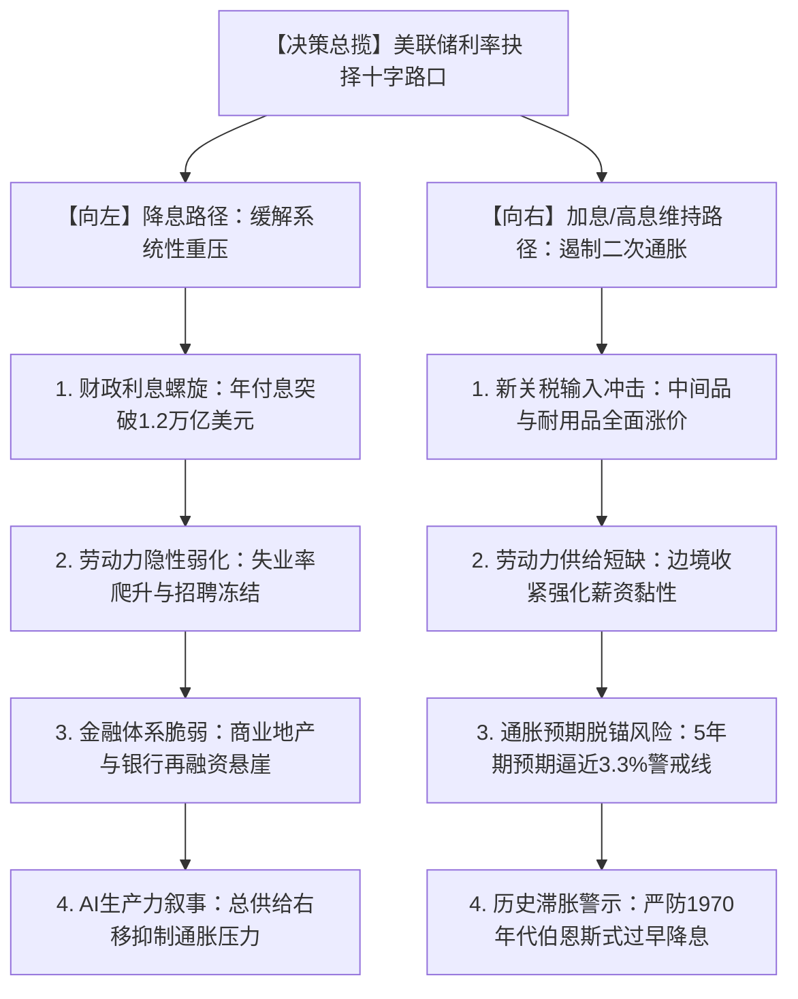
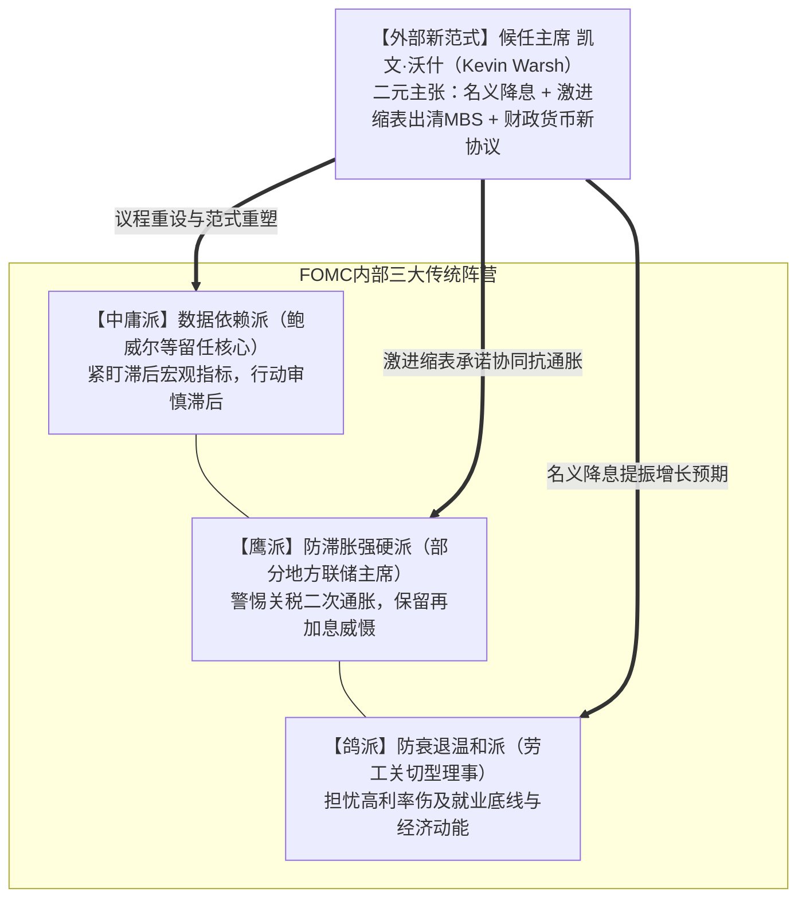
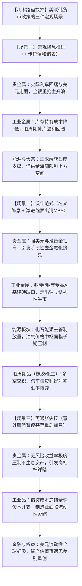

## **1. 核心摘要**

上图清晰地展现了美国债务结构的恶化轨迹：2020年疫情期间的天量救助导致联邦债务激增，而在随后的高利率周期中，由于短期国库券（T-Bills）发行量井喷，叠加美联储缩表（QT）持续削减持仓，导致大量滚动债务必须以高达4%以上的中高利率在公开市场上借新还旧。天量利息开支已经成为联邦财政赤字膨胀的最主要推手，“财政主导（Fiscal Dominance）”对货币政策的隐性约束达到了半个世纪以来的顶峰。

与以往传统的经济周期不同，当前美联储不仅面临常规宏观变量的拉扯，还遭遇了深层次的制度与人事大震荡——唐纳德·特朗普正式提名拥有“硬货币”与华尔街深厚背景的凯文·沃什（Kevin Warsh）接掌美联储。沃什的出现，带来了“降息（靠AI生产力做背书）+ 暴力缩表（抽离流动性）+ 财政货币新协议”的激进混合范式。

本文旨在系统回答四个核心问题：
1. **美联储当前的政策周期处于何种阶段？如果选择降息，其根本逻辑何在？如果被迫重启加息，诱因又是什么？**
2. **加息与降息的双向传导机制及其对宏观实体的非对称影响是什么？**
3. **美联储内部各阵营官员的真实博弈格局如何？凯文·沃什一人能否彻底扭转美联储的决策方向？**
4. **截然不同的利率路径将如何重塑大宗商品（贵金属、工业金属、能源）与全球股票市场的底层估值？**

在此基础上，本文将提出四项独家深度观点，揭示“名义降息不等于流动性宽松”、“利率工具面对供给侧通胀实质钝化”等宏观新常态。

<!--more-->

---

## **2. 美联储的降息与加息处于什么阶段？底层动因拆解**

### **2.1 周期定性：从“机械式降息”步入“进退维谷的深水平台期”**

从加息周期的顶点（5.25%-5.50%）出发，美联储曾开启了旨在校准实际利率的降息窗口。然而，走到2026年的当下，整个货币政策路径已经从初期的“顺理成章”演变为**高不确定性的“停顿观望与方向试探”（Hawkish Pause / Fork in the Road）**。

当前联邦基金利率停留在中性利率估计值之上（约4.0%左右区间波动）。美联储正被困在三重使命的交汇死角：
* **充分就业**（劳动力市场出现贝弗里奇曲线位移与招聘冻结）；
* **价格稳定**（关税冲击下的再通胀尾部风险）；
* **隐性使命：金融与主权债务稳定**（联邦政府财政支付能力与商业银行资产质量）。

### **2.2 如果要降息，为什么？（降息派的四大核心支柱）**

如果美联储在后续会议中选择降息，其背后绝非单纯的“经济过热降温”，而是面临极其现实的结构性倒逼：

1. **财政利息螺旋与“财政主导（Fiscal Dominance）”现实**  
   美国联邦总债务已跨越天量台阶，平均发债成本居高不下。联邦利息支出已超越军费开支，成为财政赤字的最主要推手。居高不下的利率正通过巨额利息反哺货币市场基金，在微观上反而产生扩张性的财政赤字刺激，形成恶性循环。财政部要求联储降息以降低国债借新还旧成本的政治诉求达到了冷战后的最高峰。
2. **劳动力市场出现隐性裂纹与经济动能放缓**  
   虽然整体失业率尚未出现悬崖式上升，但失业周期拉长、非自愿兼职比例上升、企业离职率走低等领先指标显示，劳动力需求的“缓冲垫”已被实质消耗。如果不及时将限制性利率下调至中性水平，极易触发“萨姆规则”所描述的非线性加速衰退。

> [!NOTE]
> **深度解读：什么是“萨姆规则”（Sahm Rule）？**  
> “萨姆规则”由前美联储经济学家克劳迪娅·萨姆（Claudia Sahm）于2019年提出，是宏观经济学中判定美国经济是否已进入实质性衰退的最经典、最精确的实时预警指标之一。  
> * **定量判定标准**：当**全国失业率（U-3）的3个月移动平均值**，较**过去12个月内的最低失业率**上升达到 **0.50个百分点或以上** 时，即宣告经济衰退触发。  
> * **历史经验与有效性**：在1970年以来的历次美国经济周期中，萨姆规则保持了100%的触发命中率，且几乎零虚警，其预警时效性显著优于滞后半年以上才追认衰退的美国国家经济研究局（NBER）。  
> * **当前的政策争议与困境**：在2024—2026年周期中，失业率的温和爬升曾多次逼近或短暂触碰0.50%的警界阈值，引发衰退恐慌。但萨姆本人亦指出，本轮周期的特殊性在于疫情后移民劳动力供给的大幅扩容，失业率的抬升兼具“劳动力供给增长快于吸收速度”的供给效应，而非单纯的企业暴发性倒闭与裁员潮。这种非典型特征让美联储在依据萨姆规则评估降息紧迫性时尤为权衡与纠结。

3. **金融脆弱性与信贷收缩风险**  
   高利率环境下，美国区域性银行体系持有的商业地产（CRE）贷款与低息固定收益资产浮亏仍未出清，企业再融资利差走扩。降息是避免信用利差暴雷、激活企业并购和实体资本开支的必需解药。
4. **理论新叙事：“AI驱动的总供给扩张假说”**  
   这是候任主席凯文·沃什及供给学派极力推崇的理论：人工智能、机器人与能源去管制化正在推动全要素生产率（TFP）拐点向上。总供给曲线（AS）的右移意味着经济可以在维持较高增速的同时保持物价稳定，因此美联储不需要用高利率去压抑潜在增长率。

### **2.3 如果要加息，为什么？（再加息/极限紧缩派的现实逻辑）**

加息听起来与降息大方向背道而驰，但在当前环境下，加息绝非无稽之谈，其核心触发条件聚焦于供给侧冲击：

1. **关税全面落地的输入型价格脉冲**  
   随着全面的贸易保护主义关税落地，进口中间品和消费品成本在全产业链层层传导。企业将关税成本转嫁给最终消费者，导致核心PCE指标再度抬头。若月度CPI年率反弹至3.5%以上且扩散指标（Breadth）恶化，美联储的声誉将直接面临考验。

如上图所示，在2022年6月CPI同比攀升至9.1%的四十年峰值后，美联储通过暴力加息引导了2023—2024年的“顺畅去通胀”。然而进入2025—2026年，去通胀进程在2.8%—3.1%的中高平台上彻底陷入停滞，距离2.0%的长期政策目标仍有显著距离。随着关税政策全面落地带来的输入型价格冲击，核心PCE的黏性极大地限制了联储的降息空间，甚至为鹰派随时重启加息提供了数据支撑。

2. **移民政策收紧导致的工资-物价螺旋复燃**  
   严格的边境执法与非熟练外来劳动力供应断崖，使得餐饮、建筑、物流及养老护理等低弹性服务行业的工资增长再次加速。服务业通胀具备极强的刚性，一旦固化，非加息不可压制。
3. **长期通胀预期脱锚（De-anchoring）的生存危机**  
   密歇根大学5年期通胀预期或5y5y通胀掉期（Forward Inflation Swap）若持续突破3.2%，意味着消费者与机构开始接受“高通胀常态化”。历史上，一旦通胀预期失控，央行若不采取“沃尔克式”的超预期加息重锤，将失去全球货币主权的信用基石。

从上图可以看出，疫情前美国中长期通胀预期稳定锚定在2.2%—2.6%的健康区间。但在经历了数年的物价中枢上移后，2025—2026年的5年期通胀预期不仅未能回落，反而突破3.0%的心理红线，并进一步向上刺破3.25%的脱锚危险区。对任何一任央行行长而言，长期通胀预期的脱锚都是无法容忍的系统性失职，这也是倒逼美联储鹰派随时准备重新加息的核心理论支柱。

4. **历史幽灵：重蹈1970年代阿瑟·伯恩斯（Arthur Burns）的覆辙**  
   1974-1975年美联储在通胀初现回落时便过早宣布胜利并激进降息，结果导致1978-1980年爆发更为惨烈的恶性二次滞胀，最终迫使沃尔克将利率拉升至20%。这一惨痛教训时刻警示着FOMC内部的鹰派学者。

---

## **3. 降息与加息的多维系统性影响**

| 维度 | 降息周期的系统影响 | 加息（或超长高息维持）的系统影响 |
| :--- | :--- | :--- |
| **名义流动性与汇率** | 短端无风险利率快速下行，美元指数承压，全球非美货币获得流动性喘息空间。 | 离岸美元荒加剧，全球资金加速回流美国，强势美元重创脆弱新兴市场主权信用。 |
| **政府财政与债务** | 缓解美国财政部短债发行成本，减缓利息支出在联邦赤字中的吞噬速度。 | 国债收益率全线飙升，再融资成本失控，加剧市场对美债违约或无序扩表的担忧。 |
| **企业融资与实体经济** | 降低借贷成本，刺激中小企业资本开支；但若伴随滞胀，可能催生“僵尸企业”。 | 融资链条冻结，高负债企业违约率攀升，商业地产进入实质性去杠杆出清阶段。 |
| **资产负债表与实际利率** | 实际利率（Real Yield）往往加速下行，金融资产估值倍数（P/E）得到扩张。 | 实际利率飙升至历史高位，无风险资产收益率具有极强吸引力，资产估值严重承压。 |

> [!IMPORTANT]
> **关键不对称性**：当前的货币政策传导机制呈现显著的“不对称性”。降息能够立竿见影地缓解金融负债端的现金流压力，但无法迅速修复被关税打碎的全球供应链；加息能够强力压制资本投资和耐用品消费，却对因地缘政治和能源基础设施瓶颈导致的通胀几乎无能为力。

---

## **4. 美联储官员阵营分化与“沃什变数”深度拆解**

### **4.1 美联储内部的权力图谱与思想博弈**

当前的联邦公开市场委员会（FOMC）正呈现出“三足鼎立”的割裂态势：

1. **正统中庸派（以鲍威尔为代表的留任势力）**：  
   奉行“数据依赖”（Data-dependent），言必称必须看到CPI连续数月受控以及非农新增就业的硬指标。其致命弱点在于决策高度滞后，被市场普遍戏称为“用后视镜开车”。
2. **防滞胀鹰派（如鲍曼、沃勒及部分地方联储主席）**：  
   坚定警惕通胀反扑，主张维持限制性利率不变，坚决反对在通胀指标回归2%目标之前展开连续降息，甚至在私下研讨中保留“加息应对关税冲击”的窗口。
3. **防衰退鸽派**：  
   高度重视劳动力市场的边缘恶化，认为过度紧缩正在对美国制造业回流与低收入阶层造成永久性疤痕伤害。

### **4.2 焦点剖析：凯文·沃什（Kevin Warsh）能改变决定方向吗？**

特朗普正式提名凯文·沃什接掌美联储，被视为美国现代货币史上最重要的“制度范式转移”。要评估沃什能否改变方向，必须看清他的真实政策哲学以及他在体制内的权力边界。

#### **4.2.1 沃什的政策底色：绝非简单的“白宫放水工具”**

市场在初期常常误将沃什视为特朗普希望看到的“顺从型低利率推手”，但这完全曲解了沃什三十年来的学术与实务履历。沃什在2006—2011年任理事期间是著名的“货币鹰派”，曾多次对伯南克的QE政策表达严厉质疑。

沃什真正的政策主张是一个 **“刀刃向内”的二元混合体** ：
* **在利率端（Price）**：他支持将利率降至更合理的水平，理由是为AI生产力红利提供适度的资本润滑剂；
* **在资产负债表端（Quantity）**：**他主张极其激进的量化紧缩（QT）**。沃什公开严厉抨击美联储持有数万亿美元抵押贷款支持证券（MBS）是“隐性财政救助”与对市场微观定价机制的粗暴扭曲，主张彻底清空MBS，缩减资产负债表规模；
* **在机制协同端**：倡导与财政部建立“新协议（New Accord）”，改变财政部无序短债扩张与美联储被动吞吐的割裂状态，与财政部长斯科特·贝森特（Scott Bessent）形成深度的政策同盟。

#### **4.2.2 沃什能单枪匹马改变决策方向吗？**

答案是：**在法定投票上他无法“独裁”，但在战略议程与游戏规则上他将彻底主导方向。**

1. **机制约束：美联储不是总统制机构**  
   FOMC由12名投票委员构成（7名理事+纽约联储主席+4名轮值地方联储主席）。主席是“同侪之首”（Primus inter pares），必须依靠事实说服与共识凝聚来推进政策。美联储内部长久形成的官僚体系与独立性传统，决定了沃什无法仅凭一己之愿在单次会议上强行推动超预期的大幅降息或突然加息。
2. **议程设置权（Agenda-setting Power）的颠覆**  
   主席掌控着议息会议的讨论主题、工作团队的研究方向以及会后声明的措辞。沃什如果废弃鲍威尔时代对复杂滞后模型的盲目崇拜，转向“关注流动性总量、生产力实际变量与供给侧改革”，FOMC的讨论基准就会被彻底改写。
3. **“贝森特-沃什轴心”的系统外围施压**  
   财政部掌管国债发行结构（发长债还是发短债），联储掌管流动性总闸门。当财政部与沃什形成高度默契，以往美联储单方面“对抗通胀”的旧格局将被打破，政策重心将全面转向“通过压制资产负债表规模来维护强美元购买力，通过低利率来扶持AI新生产力”。这种合力是任何单一地方联储主席都无法长期抵御的。

---

## **5. 利率决策对大宗商品与股票市场的定价重塑**

美联储不同的政策取向将直接重构各大资产的贴现率、通胀溢价与流动性中枢。

### **5.1 大宗商品市场：金融属性与物理供需的剧烈博弈**

#### **1. 贵金属（黄金、白银）：从“无脑买入”转向“防范流动性去化”**
* **传统降息视角**：降息拉低实际利率，美元下行，利好不生息的黄金与兼具工业属性的白银冲击新高。
* **沃什冲击与再加息风险视角**：2026年1月底沃什提名的消息公布后，国际金价单日崩跌超11%，白银创下单日逾13%的惊人跌幅。这揭示了贵金属定价的核心悖论——**如果降息伴随的是激进的缩表（QT）和维护美元购买力的坚定姿态，长期流动性被抽离，黄金作为对抗“无节制货币放水”的对冲价值就会被阶段性瓦解**。若因再通胀不得不重新加息，黄金甚至会遭遇惨烈的去杠杆挤兑。

#### **2. 工业金属（铜、铝、锡）与能源（原油、天然气）**
* **工业金属**：具备宏观金融与产业周期的双重属性。降息将降低保税区与贸易商的持有成本（Carrying Cost），为全球去库存周期的终结提供流动性；铜、锡因直接受益于AI数据中心扩建、电网改造及电气化，拥有极坚挺的结构性缺口。即便美联储政策犹豫，其产业刚性需求也能提供强大下限。
* **原油与天然气**：受利率周期的影响正被“供给海啸（Supply Wave）”所掩盖。非OPEC+产能扩张以及特朗普政府对化石能源管制的松绑，使油价上方存在硬天花板。除非中东地缘海峡发生全面实质性中断，否则单纯的利率降息难以催生原油超级牛市。

#### **3. 橡胶及顺周期工业品**
* 天然橡胶、顺丁橡胶等品种与汽车产销、全球重卡货运周转率紧密相关。降息带来的汽车信贷利率下降有助于激发乘用车与替换胎市场需求；但若美联储因通胀推迟降息，高息环境对耐用品消费的压抑将持续向下游传导。不过这方面的影响有限，不大可能会悖逆橡胶目前的大趋势。

### **5.2 股票市场：估值扩张的幻想与盈利质量的残酷审判**

#### **1. 美股市场（美股大盘 vs 科技巨头 vs 中小盘）**
* **如果稳步降息**：估值拔高逻辑由“科技七巨头”向利率敏感型的罗素2000（小盘股）扩散，企业债务再融资压力骤减，市场广度（Market Breadth）大幅改善。
* **如果“沃什范式”（降息+加速抽水）落地**：由于美联储抛售MBS和长债，收益率曲线可能演变为 **“熊市陡峭化（Bear Steepener）”**，即长端借贷成本不降反升。依赖自由现金流造血的AI龙头企业相对抗跌，但依赖廉价长期发债融资的高杠杆科技公司与商业地产类股将面临估值杀跌。
* **如果被迫重启加息**：美股面临“杀估值+杀盈利”的戴维斯双杀。标普500的高估值倍数将向长期历史中枢剧烈均值回归。

#### **2. A股与中国资产：外围约束松绑与风险偏好重塑**
* 美联储维持高息甚至加息讨论，是压制中国央行货币政策自主宽松空间的关键外部枷锁（汇率防守与资本外流压力）。
* 一旦美联储明确重回降息通道，中美利差倒挂收窄，人民币汇率贬值压力解除，将直接打开国内降准降息与财政发力的操作空间。全球主动型宏观对冲基金的再平衡配置，将为估值处于全球低位的A股核心资产与港股高股息板块提供强大的流动性回流增量。

---

## **6. 独家观点与前瞻研判**

基于对宏观数据、地缘博弈及美联储体制变迁的深度穿透，本文提出以下四项关于本轮利率周期的核心观点：

### **观点一：名义利率与真实流动性正在发生“历史性脱钩”——警惕“名义降息、实际收水”**
市场必须抛弃将“降息”与“大放水”画等号的思维定势。在沃什与新一届经济班底的规划中，完全可能出现一种此前极其罕见的政策组合：**基准利率调降50-75个基点以抚平白宫诉求并刺激经济，但美联储同时以每月翻倍的速度出清MBS与长期国债。**  
其结果是短端名义资金成本下降，但金融体系的底层准备金被急速回收，10年期及30年期国债收益率不降反升，按揭贷款利率与实体真实融资成本依然高企。把降息简单理解为资产普涨信号的投资者，将承受巨大的认知代价。

### **观点二：通胀已演变为“供给侧摩擦病”，传统利率工具陷入系统性钝化**
美联储当前面对的通胀，核心源自地缘重组导致的关税成本、逆全球化的供应链重复建设、能源转型瓶颈与边境政策导致的底层劳动力短缺。  
**加息无法多挖出一桶原油，加息无法在本土迅速多盖出一座先进芯片代工厂，加息更无法取消海关边境加征的关税。** 用抑制总需求的货币工具去强行对冲供给侧成本病，只会导致“通胀尚未彻底击毙、经济先已窒息”的滞胀惨剧。因此，美联储最终必须在容忍一个更高的通胀中枢（例如2.8%-3.2%）与诱发全面经济萧条之间做出妥协。

### **观点三：沃什不是白宫的附庸，而是借势推动“硬货币与新秩序重构”的操盘者**
不可低估凯文·沃什的抱负。他绝不是某些参议员所指责的“低利率傀儡”。沃什敏锐地抓住了特朗普对降息的迫切渴望，以此作为政治筹码，来换取美联储有史以来最为彻底的去杠杆、去资产负债表干预以及建立财政-货币协调新机制。  
沃什的长期目标是**维护美元内含价值的绝对统治地位**。这意味着他的底层政策终局必然是捍卫美元信用、压制过度投机泡沫。任何预期沃什上任后会带来恶性通胀和美元滥发的交易逻辑，都将面临严重的预期修正。

### **观点四：宏观配置告别“降息投机”，全面拥抱“物理约束与真实现金流”**
过去十年建立在“零利率与无限量化宽松”基础上的资产定价范式已经永久终结。未来的投资逻辑不应建立在“美联储下次会议降息还是加息25个基点”的宏观猜谜上，而必须锚定两大终极安全垫：
1. **实物资产的“物理供给硬约束”**：无论是与AI电力基建紧密绑定的铜、铀与电网关键物资，还是供给面临地理与种植周期刚性约束的天然橡胶，其价值由现实物理维度的不可替代性决定，抗宏观震荡能力远强于虚无的概念资产；
2. **权益资产的“内生自由现金流”**：在利率长期维持在3%-4%这一全新中枢平台的环境下，只有那些不需要依赖外部发债借贷续命、本身具备深厚护城河与高股息分红能力的真资产，才能在美联储的“冷热交替”风暴中笑到最后。
